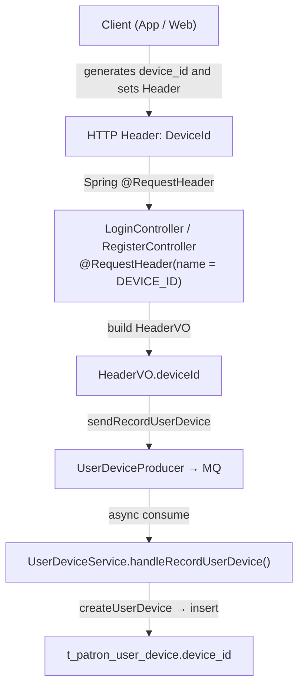
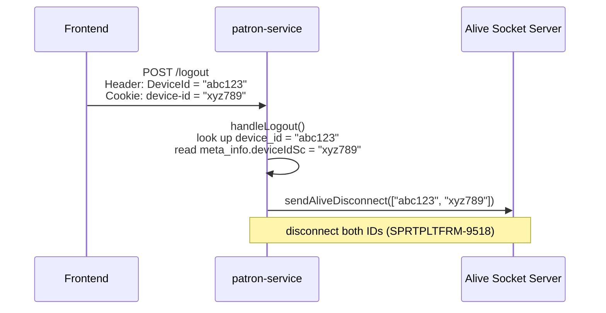

# SPLT-697

---

## Summary

**Q1 — device_id format**
The backend has zero format validation — it stores whatever the client sends. DB observation shows at least three patterns (iOS uppercase, Android lowercase, WAP containing `bdid`). Root cause requires frontend repo investigation.

**Q2 — device_id vs deviceIdSc**
Different sources: `device_id` from Header `DeviceId`, `deviceIdSc` from Cookie `device-id`. The backend never writes the `device-id` cookie (verifiable in code). Designed to be potentially different values — both are sent separately to Alive WebSocket on logout. `deviceIdSc` has three backend uses: (1) Alive disconnect, (2) 2FA device ID when configured, (3) MS query API response.

**Q3 — fingerprint backend behavior**
The backend does not calculate fingerprint. It only stores the value and uses it for: (1) Mobile register: validates max accounts per device; (2) Web login: suppresses false "new device" notifications. Calculation logic is on the client side.

**Fraud reference**
The backend's own `handleLogin()` treats matching fingerprint as evidence of the same device — this is code-verifiable. For Web users, `fingerprint` is a more reliable tracking field than `device_id`.

---

## Q1: Why are there multiple device_id formats?

The backend has **zero format constraints** on `device_id`:
- No regex check
- No length limit
- No UUID format validation
- Only processing: `UserOperationLogEntity.trim()`

The backend only sees an arbitrary string. **The following formats are from DB observation** — root cause requires frontend repo investigation:

| Platform | Format | Example |
|----------|--------|---------|
| iOS | 32-char uppercase hex, no dash | `B9F4DFA6...56FFE` |
| Android | 32-char lowercase hex, no dash | `a34ca813...e6d0b` |
| WAP | Shorter, contains `bdid` | `260420...bdid...` |

### Code Path



**Key code locations:**
- Header constant: `common/common-constant/.../RequestHeaders.java:7` → `DEVICE_ID = "DeviceId"`
- Controller read: `service-patron/.../LoginController.java:168` → `@RequestHeader(name = DEVICE_ID) String deviceId`
- DB write: `service-patron/.../UserDeviceService.java:334` → `.setDeviceId(userDeviceTO.getHeaderVO().getDeviceId())`

---

## Q2: device_id column vs meta_info.deviceIdSc

### What they are

|                  | `device_id` column        | `meta_info.deviceIdSc`                                        |
|------------------|---------------------------|---------------------------------------------------------------|
| Source           | HTTP Header `DeviceId`    | Cookie `device-id` (lowercase with dash)                      |
| Purpose          | See below                 | See below                                                     |
| Backend behavior | Read and stored in column | Read and stored in meta_info; cookie never written by backend |

**`deviceIdSc` backend uses:**
1. **Alive WebSocket disconnection** (logout / block) — sent together with `device_id` to Alive to disconnect both connections
2. **2FA device ID source** — when `patron.2fa.use.persistent.device.id=true`, 2FA uses `deviceIdSc` instead of Header `DeviceId` (`TwoFactorDeviceIdResolverImpl.java:41`); used in `BrazilTwoFactorAuthLoginService`, `TwoFactorAuthController`, `OrdinanceRegisterFacialRecognitionService`
3. **MS query API response** — `UserDeviceQueryMsController` includes it when returning device records

Re-stored into `meta_info` on every login/register to ensure the two runtime uses (disconnect, 2FA) always have the latest value.

### How deviceIdSc gets stored in meta_info

At login/register, the backend receives both the Header and Cookie and stores them together:

```
Request
  Header: DeviceId = "..."   → HeaderVO.deviceId   → t_patron_user_device.device_id (column)
  Cookie: device-id = "..."  → HeaderVO.deviceIdSc → meta_info JSON deviceIdSc
```

`LoginController.java:179` `@CookieValue(name = "device-id")` → `HeaderVO.deviceIdSc` → `UserDeviceService.java:347` `.setDeviceIdSc(...)`

### Are they the same value?

**The backend design assumes they are different values.**

Verifiable directly from code:
- `"device-id"` cookie — all 30+ occurrences in the backend are `@CookieValue` (reads only); **`response.addCookie` is never called with this name**
- `"deviceId"` cookie (camelCase, no dash) — written by the backend itself (`LoginController.java:283`, `DEVICE_ID_COOKIE` constant), value equals the `DeviceId` Header

Different cookie names, different writers. At logout, the backend sends both values separately to Alive for disconnection, confirming the design assumes they may differ.

> Who sets the `device-id` cookie and when **requires frontend repo confirmation**.

### Why store deviceIdSc?

At logout/block, two Alive WebSocket connections must be disconnected simultaneously:



**Key code:** `UserDeviceService.java:193-199`
```java
Set<String> deviceIdSet = new HashSet<>();
deviceIdSet.add(userDeviceTO.getHeaderVO().getDeviceId());
if (userDevice != null && userDevice.getMetaInfo() != null
        && StringUtils.isNotBlank(userDevice.getMetaInfo().getDeviceIdSc())) {
    deviceIdSet.add(userDevice.getMetaInfo().getDeviceIdSc());
}
sendAliveDisconnect(new ArrayList<>(deviceIdSet));
```

---

## Q3: Fingerprint backend behavior

The backend does not calculate fingerprint — it only stores and compares the value. Calculation logic requires frontend repo investigation.

### Mobile (Android / iOS)

Mandatory validation at register (`UserSignService.java:135-142`): max 4 accounts per fingerprint within 365 days (configurable via app config).

```java
if (PlatformEnum.ANDROID ... || PlatformEnum.IOS ...) {
    Long fingerprintLimit = appConfigService.transform("fingerprint.register.limit", Long.class, 4L);
    Long fingerprintTimeoutDays = appConfigService.transform("fingerprint.register.timeout.days", Long.class, 365L);
    Long fingerprintCount = slaveUserAdditionalInfoEntityMapper.countFingerprintRegistered(fingerprint, ip, from);
    return fingerprintLimit > fingerprintCount;
}
```

### Web / WAP / LITE

Used in handleLogin to determine whether to suppress "new device" notifications (`UserDeviceService.java:394-411`):
- Same userId + same fingerprint already has a LOGIN/LOGOUT record → treated as same device, no notification sent
- Fingerprint is blank, or platform is not WEB/WAP/LITE → check skipped

See [03-handleLogin-detail.md](./03-handleLogin-detail.md) for the full flow.

---

## Fraud Data Reference

The backend's own `handleLogin()` treats fingerprint as a more stable Web device identifier than `device_id`: when `device_id` differs but fingerprint matches, the backend considers it the same device and suppresses the new device notification. This is directly observable from code (`UserDeviceService.java:394-411`).

**For Web users, use `fingerprint` as the primary device tracking field.**

Stability of other meta_info fields (`appInstanceId`, `deviceIdSc`, `phoneModel`) requires frontend repo confirmation.