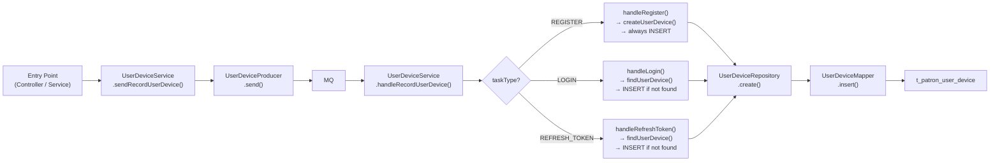
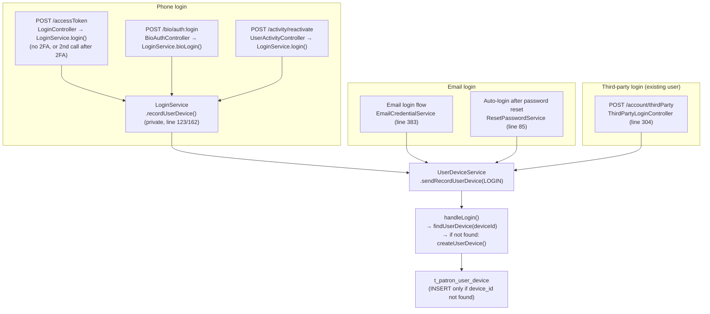
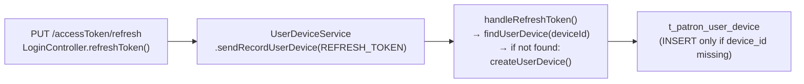

# SPLT-697: device_id Write Paths

---

## Core Mechanism (shared by all paths)

All writes go through the same async pipeline:

---

## REGISTER path (handleRegister → always INSERT)

```mermaid
flowchart TD
    subgraph RegisterController ["RegisterController"]
        R1["POST /account\nregister()"]
        R2["POST /accountNoSendMsg\nregisterNoSendingMsg()"]
        R3["PUT /account/{id}/completeByOtp\nvalidateRegisterOtpCode()"]
        R4["PUT /account/{id}/complete\nvalidateRegisterPhoneVerifyCode()"]
        R5["PUT /account/{id}/completeBySms|completeByCall\ncompleteBySms()"]
        R6["POST /account/create\nregisterOneStep()"]
        RP["private registerProcess()"]
    end

    subgraph ThirdPartyLoginController ["ThirdPartyLoginController"]
        T1["POST /account/thirdParty\n(new user branch)"]
        T2["PUT /account/completeThirdParty"]
        T3["PUT /account/completeThirdPartyBySms"]
        T4["PUT /account/completeThirdPartyByVoiceOtp"]
    end

    subgraph OtherEntry ["Other entry points"]
        P1["POST /verifyCode/sms\nPhoneVerifyCodeController\n(OTP verify complete branch)"]
        P2["POST /ms/account/addAndActive\nUserSignMsController\n(internal MS API)"]
        P3["Email verification flow\nUserDevicePostActivateHandler\n(requires patron.service.email.registration.enable=true)"]
        P4["KycRegisterActivateStrategy /\nSimpleKycRegisterActivateStrategy\n→ UserActivityService.activity()"]
    end

    SEND["UserDeviceService\n.sendRecordUserDevice(REGISTER)"]
    DB["t_patron_user_device\n(INSERT)"]

    R1 --> RP --> SEND
    R2 --> RP
    R3 --> SEND
    R4 --> SEND
    R5 --> SEND
    R6 --> SEND
    T1 --> SEND
    T2 --> SEND
    T3 --> SEND
    T4 --> SEND
    P1 --> SEND
    P2 --> SEND
    P3 --> SEND
    P4 --> SEND
    SEND --> DB
```

---

## LOGIN path (handleLogin → INSERT if device_id not found)

> **Note:** `handleLogin()` contains fingerprint check logic. See [03-handleLogin-detail.md](./03-handleLogin-detail.md).

---

## REFRESH_TOKEN path (edge case)

---

## When does a new device_id get written?

| Scenario                                | TaskType      | INSERT condition                  |
|-----------------------------------------|---------------|-----------------------------------|
| User completes registration             | REGISTER      | Always                            |
| User logs in (new device)               | LOGIN         | Only if device_id not found in DB |
| Token refresh (edge case)               | REFRESH_TOKEN | Only if device_id not found in DB |
| Logout / force logout / block / unblock | N/A           | UPDATE only, never INSERT         |