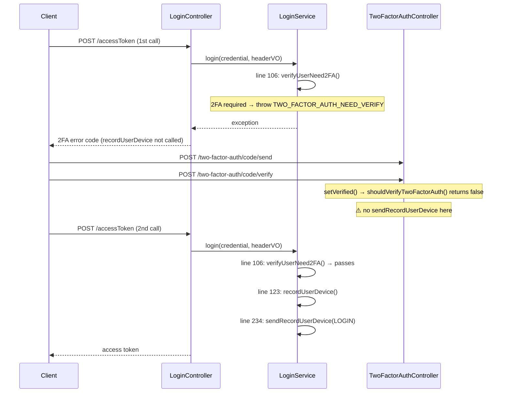
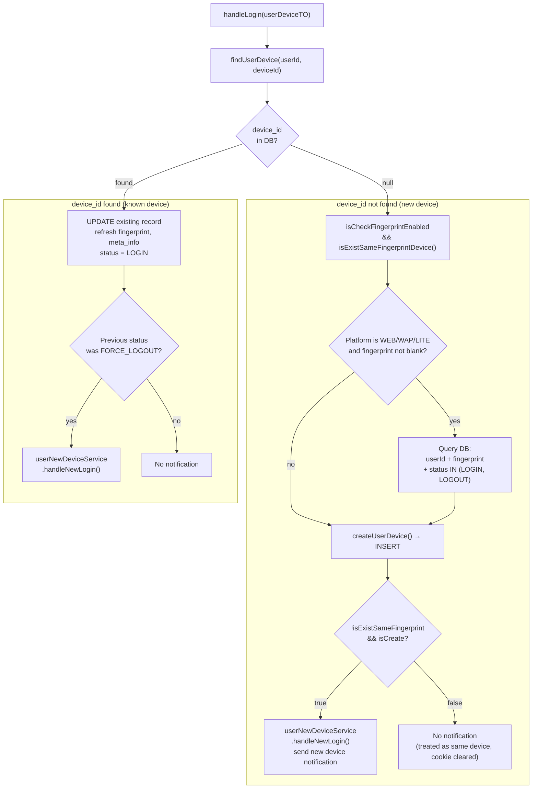

# SPLT-697: handleLogin() Internals

---

## 2FA Branch

`LoginService.login()` calls `verifyUserNeed2FA()` at line 106. If 2FA is required, it throws an exception immediately and **`recordUserDevice()` is never reached**. The device record is only written on the **second call to `/accessToken`** after the user completes 2FA verification.

---

## handleLogin() Fingerprint Check

**Code location:** `UserDeviceService.java:147-185`, `UserDeviceService.java:394-411`

---

## Outcome Summary

| Scenario                                                                | INSERT?          | New device notification?             |
|-------------------------------------------------------------------------|------------------|--------------------------------------|
| New device_id, fingerprint is new                                       | Yes              | Yes                                  |
| New device_id, fingerprint already exists (re-login after cookie clear) | Yes              | No — suppressed to avoid false alert |
| New device_id, platform is not WEB/WAP/LITE (App)                       | Yes              | Yes (fingerprint check skipped)      |
| Known device_id, normal login                                           | No — UPDATE only | No                                   |
| Known device_id, previous status was FORCE_LOGOUT                       | No — UPDATE only | Yes                                  |

> **Fingerprint's role in handleLogin:** does not affect whether a record is written — only used to **prevent Web users from being flagged as a brand new device after clearing cookies**, avoiding unnecessary new device login notifications.