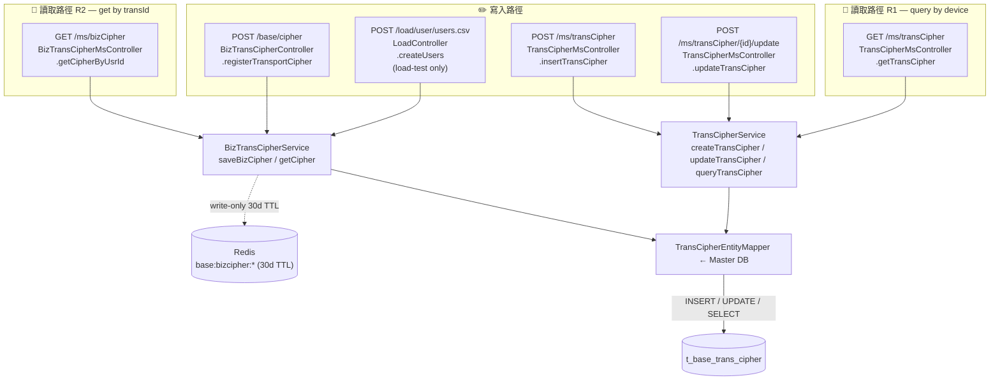
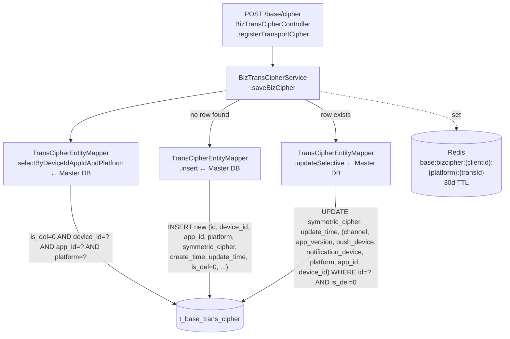
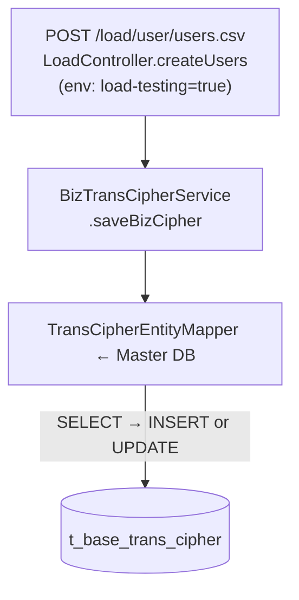
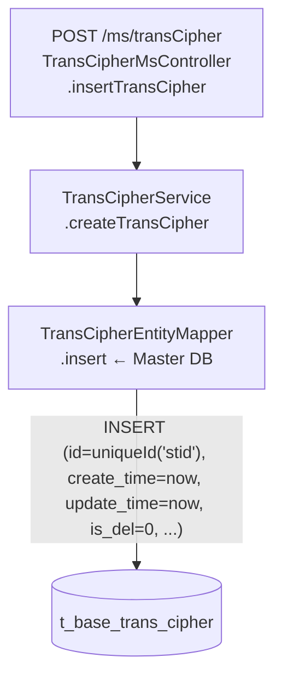
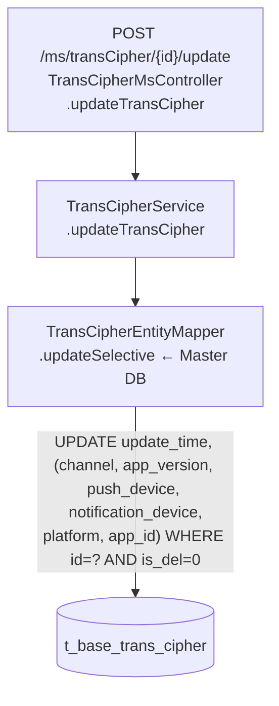
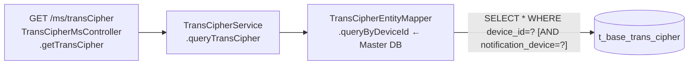
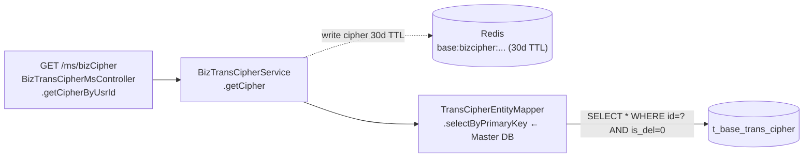

# Archive Analysis Report: `t_base_trans_cipher`

**Generated:** 2026-04-22
**Database:** `afbet_main` (per migration `V28__SSS-2251-trans-cipher.sql` seed data)
**SOP Reference:** https://opennetltd.atlassian.net/wiki/spaces/DBA/pages/4252532749

---

## Assessment Scope

> This report is a backend code-based assessment of whether `t_base_trans_cipher`
> supports a safe archive rule under the current implementation.
>
> Conclusion from current code behavior:
> `t_base_trans_cipher` can be archived on **`update_time`** (minimum threshold:
> **> 30 days**, i.e. beyond the Redis TTL), but **cannot** be archived on
> `is_del = 1` (never flipped) and should **not** be archived purely on
> `create_time` because the row lifecycle is re-activated by every
> `POST /base/cipher` refresh. The final retention value `N` is blocked on **B2**
> — see Risk Summary and 最終建議.

---

## Assumptions / Confidence

- Archive predicate: **working assumption** — `update_time < DATE_SUB(CURDATE(), INTERVAL N DAY)`.
- Retention window: **minimum N > 30 days** (Redis TTL). Once `update_time` is
  older than the Redis TTL, the Redis cache for that row is guaranteed to have
  expired. The actual value of `N` is blocked on **B2** — see 最終建議.
- Note: R2 (`getCipher`) always queries the master DB and writes to Redis on hit;
  it does **not** read from Redis and does **not** refresh `update_time`.
  Calling R2 repeatedly does not extend a row's effective lifetime under an
  `update_time`-based archive rule.
- `is_del`: **never set to 1** in code. It is not a viable archive signal —
  documented as a risk, not an input to the rule.
- Report label: **`preliminary`** until B2 is resolved (see Action Items).

---

## Blocker / Risk Summary

| #  | Risk                                                                    | Severity   | Detail                                                                                                                                                                                                                  |
|----|-------------------------------------------------------------------------|------------|-------------------------------------------------------------------------------------------------------------------------------------------------------------------------------------------------------------------------|
| B1 | `is_del` is never flipped to `1`                                        | **HIGH**   | Both `BizTransCipherService.saveBizCipher` and `TransCipherService.createTransCipher` write `is_del = false`, and no code path ever sets it to `true`. It cannot serve as an archive predicate.                         |
| B2 | `transId` (PK) continuity across archival                               | **HIGH**   | `GET /ms/bizCipher?transId=…` (R2) looks up by PK with `is_del = 0` only, no time bound. On miss, `getCipher` returns `null` wrapped in a `200 success` response — no error thrown, no new row inserted. Callers must handle `null` data explicitly; what they do is **outside this repo**. |
| B3 | `/ms/transCipher/{id}/update` (U1) can touch arbitrarily old rows       | **MEDIUM** | The endpoint only keys on `id`; callers are not bounded to recent rows. No Feign client for U1 was found in `service-patron-api`; actual callers are **outside this repo**. Archiving by `update_time` is safe only if U1 traffic demonstrably targets rows well inside the retention window.  |
| B4 | R1 (`GET /ms/transCipher`) returns history by `device_id`, unbounded    | **MEDIUM** | `queryByDeviceId` has no date filter. Consumers relying on the full per-device history will see fewer rows after archival. No Feign client for R1 was found in `service-patron-api`; actual caller use is **outside this repo**.                                                              |
| B5 | Create-time archive is unsafe                                           | **MEDIUM** | W1 refreshes `update_time` on every re-registration of the same `(device_id, app_id, platform)`; `create_time` stays at the row's first insert. Archiving by `create_time` would remove actively-used rows.             |
| B6 | Seed migration points at `afbet_main.t_base_trans_cipher`               | **LOW**    | `V28__SSS-2251-trans-cipher.sql` inserts into `afbet_main.t_base_trans_cipher`. Confirm actual production schema (`afbet_main` vs `afbet_patron`) before issuing the archive DDL.                                       |

---

## DDL Summary

```sql
CREATE TABLE `t_base_trans_cipher` (
  `id`                    varchar(45)  NOT NULL,              -- PK, also returned to clients as transId
  `device_id`             varchar(45)  DEFAULT NULL,          -- device identifier (indexed)
  `symmetric_cipher`      varchar(45)  DEFAULT NULL,          -- AES key for the device
  `public_cipher`         varchar(256) DEFAULT NULL,          -- RSA public key
  `private_cipher`        varchar(128) DEFAULT NULL,          -- RSA private key
  `platform`              varchar(45)  DEFAULT NULL,          -- platform tag
  `app_id`                varchar(45)  DEFAULT NULL,          -- client / application ID
  `create_time`           timestamp    NULL DEFAULT NULL,     -- row creation time (indexed)
  `update_time`           timestamp    NULL DEFAULT NULL,     -- last write time (indexed)
  `is_del`                tinyint(4)   DEFAULT NULL,          -- soft-delete flag (UNUSED — always 0)
  `push_device`           varchar(256) DEFAULT NULL,          -- push token
  `notification_device`   varchar(256) DEFAULT NULL,          -- notification push token
  `channel`               varchar(45)  DEFAULT NULL,
  `app_version`           varchar(12)  DEFAULT NULL,
  PRIMARY KEY (`id`),
  KEY `idx_device_id`   (`device_id`),
  KEY `idx_create_time` (`create_time`),
  KEY `idx_update_time` (`update_time`)
) ENGINE=InnoDB DEFAULT CHARSET=utf8;
```

### Index Readiness for Archive

| Index             | Column        | Archive Use                 | Note                                                                                    |
|-------------------|---------------|-----------------------------|-----------------------------------------------------------------------------------------|
| PRIMARY           | `id`          | Point-delete safe           | All read/write paths touch PK; R2 reads by PK                                           |
| `idx_device_id`   | `device_id`   | Range lookup possible       | W1 lookup and R1 read use this                                                          |
| `idx_create_time` | `create_time` | Range scan available        | Exists, but `create_time` is **not** the right archive dimension — see B5               |
| `idx_update_time` | `update_time` | **Recommended for archive** | Exists; matches the activity signal since W1 refreshes `update_time` on every re-register |

> Both `idx_create_time` and `idx_update_time` already exist, so no index work
> is blocking archival. The correctness question is which column to archive on.

---

## Basic Judgment

- `idx_create_time`: **yes**
- `idx_update_time`: **yes**
- Archive candidate column (recommended): **`update_time`**
- `is_del` usable as predicate: **no** (never set to 1)
- Write-once: **no** — `UPDATE` exists on W1 refresh and U1 manual updates
- Direct mapper count: **1** (`TransCipherEntityMapper` — master DB only, no slave mapper)
- Total path count: **6** (3 write/update + 2 read + 1 load-test write)

---

## Overall Dependency Diagram



---

## Per-Path Details

### ✏️ W1 — `POST /base/cipher` (public client registration / refresh)



Summary:

| Step | Component | Action | Touched Columns |
|------|-----------|--------|-----------------|
| 1    | `BizTransCipherController.registerTransportCipher` | read headers, derive/generate deviceId (`bdid`) | — |
| 2    | `BizTransCipherService.saveBizCipher` | look up existing row by `(device_id, app_id, platform)` | `id, device_id, app_id, platform, symmetric_cipher, create_time, update_time, is_del, push_device, notification_device, channel, app_version` |
| 3    | `TransCipherEntityMapper.insert` (if none) | INSERT a new row with `create_time = update_time = now`, `is_del = 0` | all columns |
| 4    | `TransCipherEntityMapper.updateSelective` (if existing) | UPDATE `symmetric_cipher` and `update_time` (plus any provided fields) WHERE `id=? AND is_del=0` | `symmetric_cipher, update_time` + selective others |
| 5    | Redis | write `symmetric_cipher` to `base:bizcipher:{clientId}:{platform}:{transId}` for 30 days | — |

Consumer visible purpose:

- Bootstraps or refreshes the per-device AES key that the client uses to encrypt
  subsequent API traffic. The response returns `transId` (= table PK `id`) to
  the client.

### ✏️ W2 — `POST /load/user/users.csv` (load-testing only)



Summary:

- Gated by `@ConditionalOnProperty("environment.load-testing"=="true")`.
- Delegates straight to `BizTransCipherService.saveBizCipher`, so the SQL shape
  is identical to W1.
- Produced rows have the same lifecycle as W1; no special archival concern.

### ✏️ W3 — `POST /ms/transCipher` (internal MS insert)



Summary:

- Service generates its own `id` via `UniqueID.getUniqueId("stid")`.
- No Feign client for `/ms/transCipher` was found in `service-patron-api`;
  callers are **outside this repo**.

### ✏️ U1 — `POST /ms/transCipher/{id}/update` (internal MS update)



Summary:

- Sets `update_time = now` and any caller-provided push / version / channel
  fields on the row identified by PK.
- Does **not** bound rows by age; any historical row could be touched. This is
  the main driver of B3.
- No Feign client for this endpoint was found in `service-patron-api`; actual
  callers are **outside this repo**.

### 📖 R1 — `GET /ms/transCipher` (query by deviceId)



Summary:

- No date bound at all. Returns every row for the given `device_id` (optionally
  filtered by `notification_device`).
- `is_del` is **not** in the WHERE clause, so even if B1 were fixed it would
  still return "deleted" rows.
- Consumer visible purpose: internal lookup (the MS endpoint is not exposed via
  `service-patron-api` as a Feign client either).

### 📖 R2 — `GET /ms/bizCipher` (get symmetric cipher by transId)



Summary:

- Lookup by PK only — no time bound. This is the exact path that would be
  broken by archiving a row whose `transId` is still in use by a client (B2).
- Feign-exposed via `BizTransCipherMservice.getCipherByTransId`.
- `getCipher` **always queries the master DB** (no Redis read within
  service-patron; only `redisWriter` is injected). On a successful DB hit the
  symmetric cipher is written to Redis for 30 days. Who reads this Redis key
  is **outside this repo** and cannot be confirmed here.
- This path does **not** refresh `update_time`. A row that is accessed only via
  R2 (never re-registered via W1) will have its `update_time` frozen at the
  last W1 call, and will be archived once that timestamp crosses the retention
  threshold — even if R2 is called regularly.
- **On miss** (`record == null`): returns `null` wrapped in a `200 success`
  response (`ResponseBuilder.success(null)`). No new cipher row is inserted.
  Callers must handle `null` data explicitly; what happens when a caller
  receives null is **outside this repo**.

---

## Column-Access Matrix

| Path | Direction | Mapper                              | Touched Columns                                                                                                                                | WHERE Columns                              | Lookback / Dimension                   |
|------|-----------|-------------------------------------|------------------------------------------------------------------------------------------------------------------------------------------------|--------------------------------------------|----------------------------------------|
| W1   | write     | `selectByDeviceIdAppIdAndPlatform` → `insert` / `updateSelective` | `id, device_id, app_id, platform, symmetric_cipher, public_cipher, private_cipher, create_time, update_time, is_del, push_device, notification_device, channel, app_version` | `device_id, app_id, platform, is_del`; then `id, is_del` | refresh path — bumps `update_time`     |
| W2   | write     | same as W1                          | same as W1                                                                                                                                     | same as W1                                 | same as W1 (load-test only)            |
| W3   | write     | `insert`                            | all insert columns                                                                                                                             | —                                          | new row, `create_time = update_time`   |
| U1   | write     | `updateSelective`                   | `update_time, channel, app_version, push_device, notification_device, platform, app_id, device_id, symmetric_cipher`                           | `id, is_del`                               | unbounded — any age                    |
| R1   | read      | `queryByDeviceId`                   | all columns                                                                                                                                    | `device_id` (+ optional `notification_device`) | unbounded history per device          |
| R2   | read      | `selectByPrimaryKey`                | all columns                                                                                                                                    | `id, is_del`                               | unbounded — any age of a live transId  |

---

## Archive Rule Evaluation

### Q1–Q4 Decision Matrix

Q1–Q3 are path-level. Q4 is the table-level stability judgment and may repeat
across rows.

| Path | Lookback / Dimension                | Q1 (latest-only) | Q2 (recent window matches predicate) | Q3 (partial-history acceptable) | Q4 (table stability) | Outcome / Evidence |
|------|-------------------------------------|------------------|---------------------------------------|---------------------------------|----------------------|--------------------|
| W1   | write — refreshes `update_time`     | N/A (write)      | N/A                                   | N/A                             | blocker-neutral      | `acceptable` — re-activation updates `update_time`, so row falls outside the archive cutoff automatically |
| W2   | write — same as W1 (load-test)      | N/A              | N/A                                   | N/A                             | same as W1           | `acceptable` — same lifecycle |
| W3   | write — INSERT new PK               | N/A              | N/A                                   | N/A                             | fresh row            | `acceptable` — new rows are young |
| U1   | update by `id` only, no age bound   | NO               | NO (no time filter)                   | UNKNOWN (callers unknown; no Feign client found in service-patron-api) | table-level **NO**   | `conditional` — U1 can reach arbitrarily old rows; confirm callers before committing a short retention |
| R1   | SELECT by `device_id`, unbounded    | NO (list query, no `LIMIT 1`) | NO (no date bound)       | UNKNOWN (no Feign client found in service-patron-api) | n/a | `conditional` — losing older per-device rows is acceptable only if no caller depends on full history; cannot confirm from this repo |
| R2   | SELECT by PK `id`, `is_del=0`       | YES (PK is the business key) | NO (no date bound)        | NO (archiving removes a live cipher → breaks client traffic decryption) | table-level depends on client hold-time | `blocker` unless retention ≥ real-world max idle time of a live `transId` |

### Q4 table-level notes

- Rows are mutated after insertion:
  - W1 refreshes `update_time` on every re-registration of the same
    `(device_id, app_id, platform)` — this is exactly what makes `update_time`
    a valid activity signal.
  - U1 sets `update_time = now` whenever called, but its callers are not
    restricted to recent rows. This is a caller-discipline question, not a
    schema defect.
- Rows are never soft-deleted (`is_del` stays `0`).
- No scheduled job, reconciliation, backfill, or MQ consumer touches the table.

### 最終建議

Confidence:
- `preliminary` — the retention number `N` cannot be locked without resolving
  **B2**: what does the caller of `GET /ms/bizCipher` do when it receives
  `{ code: 200, data: null }`?

Assumptions:
- Archive predicate: `update_time < DATE_SUB(CURDATE(), INTERVAL N DAY)`.
- **Minimum viable N: > 30 days (Redis TTL).**
  Rationale: once `update_time` is older than the Redis TTL, the Redis cache
  for that row is guaranteed to have expired. Any subsequent access must go
  through R2 → DB. Archiving below this threshold would remove rows whose
  Redis cache is still live, bypassing DB entirely and making the miss
  invisible until the next cache expiry.
- **Actual N depends entirely on B2 (single blocker):**
  - If the caller handles `null` and triggers a W1 re-registration →
    even `N = 30` (Redis TTL) may be sufficient; the client will recover
    automatically on the next access.
  - If the caller does not handle `null` gracefully → `N` must be ≥ the
    longest realistic interval between `POST /base/cipher` calls for any
    active client. That number is **outside this repo** and requires
    client-team confirmation.
- Note: calling R2 does **not** refresh `update_time`. A row accessed only
  via R2 (no subsequent W1 call) has its `update_time` frozen at the last
  W1 registration and will be archived once it crosses the `N`-day threshold,
  regardless of R2 call frequency.

Archive Rule: `[x] Required / [ ] Not Required`

Condition:
- `update_time < DATE_SUB(CURDATE(), INTERVAL N DAY)` where **N > 30** (Redis TTL lower bound).
  Final value of N is blocked on B2 resolution (see above).

idx_update_time:
- ✅ already exists

idx_create_time:
- ✅ already exists (not used for archive, retained for other range queries)

write-once:
- ⚠️ `UPDATE` found:
  - W1 `updateSelective` — refreshes `update_time` legitimately; compatible with an `update_time`-based rule.
  - U1 `updateSelective` via `POST /ms/transCipher/{id}/update` — can reach arbitrarily old rows; caller discipline must be verified.

風險項目:
- **B1** — `is_del` is never set to `1`; do not key the archive rule on `is_del` (and consider removing or repurposing the column in a follow-up).
- **B2 (single blocker for N)** — R2 (`/ms/bizCipher`) returns `{ code: 200, data: null }` on miss — no error, no auto-insert. The retention value `N` cannot be finalized until the caller's null-handling behavior is confirmed: if it triggers W1 re-registration, a short retention is safe; if it does not, `N` must cover the longest client dormancy window.
- **B3** — U1 can update old rows; either restrict U1 callers to recent rows, or accept that a manual ops update could "revive" a row that had been close to the archive cutoff.
- **B4** — R1 returns unbounded history per device; confirm no audit / support tooling depends on old rows.
- **B5** — do **not** archive on `create_time`; it is the original insert time and does not reflect activity.
- **B6** — production schema (`afbet_main` vs `afbet_patron`) must be confirmed before issuing the archive DDL; seed migration uses `afbet_main`.

Action items before DBA review:
- [ ] **(Blocker for N)** Confirm with the caller team of `GET /ms/bizCipher`: when the response returns `{ data: null }`, does the caller trigger a W1 re-registration (`POST /base/cipher`), or does it propagate / fail silently? This single answer determines the final retention value `N`.
- [ ] Confirm production database/schema (`afbet_main` vs `afbet_patron`) that owns `t_base_trans_cipher`.
- [ ] Audit the callers (if any) of `POST /ms/transCipher/{id}/update` (U1). No Feign client was found in `service-patron-api`. If unused, consider deprecating it; otherwise document that U1 may target old rows.
- [ ] Audit the callers (if any) of `GET /ms/transCipher` (R1) and `POST /ms/transCipher` (W3). No Feign client was found in `service-patron-api`; these endpoints may be dead code reachable only via direct HTTP.
- [ ] Decide what to do with `is_del` (column is functionally dead — always `0`). Either populate it on real deletions, drop it, or document its state explicitly.
- [ ] Once B2 is resolved, lock the retention value `N` (minimum: > 30 days) and downgrade `Confidence` to `review-ready`.