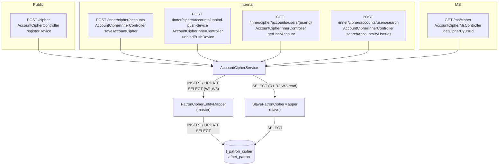
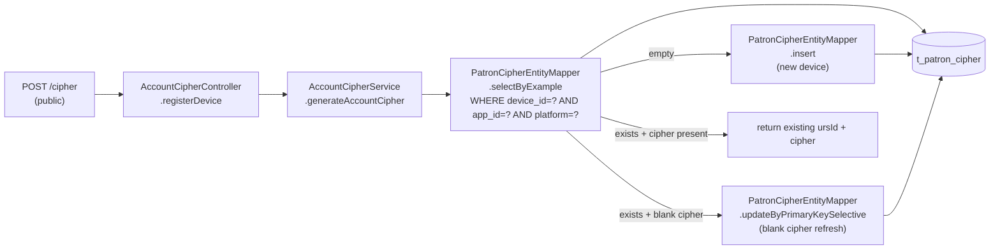
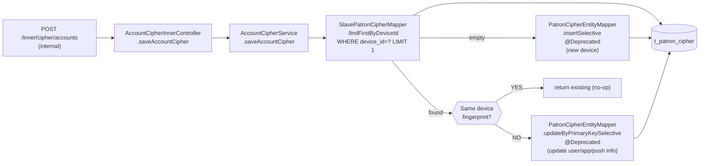
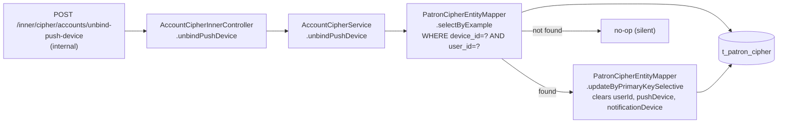
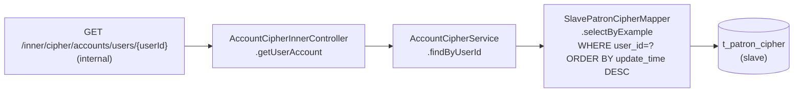
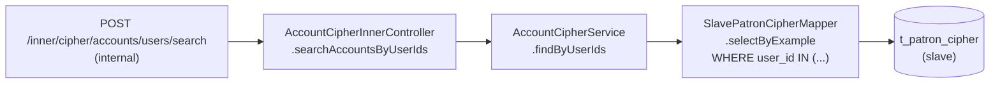
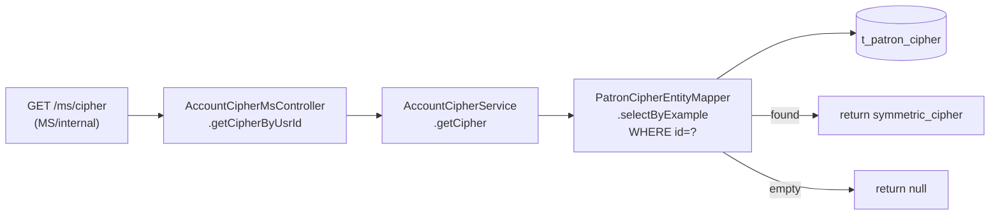

# Archive Analysis Report: `t_patron_cipher`

**Generated:** 2026-04-21  
**Database:** `afbet_patron`  
**SOP Reference:** https://opennetltd.atlassian.net/wiki/spaces/DBA/pages/4252532749

---

## Assessment Scope

> This report is a backend code-based assessment of whether `t_patron_cipher`
> supports a safe archive rule under the current implementation.
>
> Conclusion from current code behavior:
> `t_patron_cipher` should **not** be archived based on `update_time`, `user_id`, or `is_del`
> under the current implementation.

---

## Blocker / Risk Summary

| #  | Risk                                                           | Severity   | Detail                                                                                                                                                                                                                        |
|----|----------------------------------------------------------------|------------|-------------------------------------------------------------------------------------------------------------------------------------------------------------------------------------------------------------------------------|
| B1 | `ursId` lifecycle is not tied to `update_time`                 | **HIGH**   | `GET /ms/cipher` fetches the cipher by `id`, while `POST /cipher` can keep returning an existing `ursId` + cipher without refreshing `update_time`. A stale `update_time` therefore does not mean the row is safe to archive. |
| B2 | `user_id` empty / null is not a safe inactivity signal         | **HIGH**   | `POST /cipher` creates device cipher rows before user binding. A row can still represent a live device/cipher even when `user_id` is blank or `NULL`.                                                                         |
| B3 | Missing rows are recreated, but old `ursId` continuity is lost | **HIGH**   | If an old row is archived and the same device comes back, W1 inserts a new row with a new `ursId` + cipher. Any client or service still using the old `ursId` will fail on `/ms/cipher`.                                      |
| B4 | W2 create path does not recreate `symmetric_cipher`            | **MEDIUM** | `saveAccountCipher` can recreate metadata by `device_id`, but its insert path does not write `symmetric_cipher`. W2 is therefore not a full recovery path after archival.                                                     |
| B5 | `is_del` soft-delete is never set to `1`                       | **MEDIUM** | The `is_del` column is always written as `false` (0) on INSERT and never flipped to `true` anywhere in the codebase. It cannot serve as an archive predicate.                                                                 |

---

## DDL Summary

```sql
CREATE TABLE `t_patron_cipher` (
  `id`                    varchar(45)  NOT NULL,           -- PK; also used as ursId by clients
  `device_id`             varchar(45)  DEFAULT NULL,       -- device identifier (indexed)
  `symmetric_cipher`      varchar(45)  DEFAULT NULL,       -- AES key for the device
  `platform`              varchar(45)  DEFAULT NULL,       -- platform tag
  `app_id`                varchar(45)  DEFAULT NULL,       -- client/application ID
  `create_time`           timestamp    NULL DEFAULT NULL,  -- row creation time
  `update_time`           timestamp    NULL DEFAULT NULL,  -- last modification time for some write paths only
  `is_del`                tinyint(4)   DEFAULT NULL,       -- soft-delete flag (UNUSED — always 0)
  `push_device`           varchar(256) DEFAULT NULL,       -- push token
  `notification_device`   varchar(256) DEFAULT NULL,       -- notification push token
  `user_id`               varchar(45)  DEFAULT NULL,       -- linked user (can be cleared)
  `channel`               varchar(45)  DEFAULT NULL,
  `app_version`           varchar(12)  DEFAULT NULL,
  PRIMARY KEY (`id`),
  KEY `idx_device_id` (`device_id`),
  KEY `idx_user_id`   (`user_id`)
) ENGINE=InnoDB DEFAULT CHARSET=utf8;
```

### Index Readiness for Archive

| Index           | Column        | Archive Use            | Note                                                                                             |
|-----------------|---------------|------------------------|--------------------------------------------------------------------------------------------------|
| PRIMARY         | `id`          | Point-delete safe      | All read/write paths touch PK                                                                    |
| `idx_device_id` | `device_id`   | Range-archive possible | W1/W2 use this for lookups                                                                       |
| `idx_user_id`   | `user_id`     | Range-archive by user  | R1/R2 use this for reads                                                                         |
| _(none)_        | `update_time` | **Missing**            | Missing index is a performance issue only; it does not make `update_time` a valid archive signal |
| _(none)_        | `create_time` | Not sufficient         | Creation age does not imply cipher inactivity                                                    |

> **Note:** Indexing is a performance topic only. It does **not** change the correctness conclusion
> that `update_time` is not a reliable inactivity signal.

---

## Overall Dependency Diagram



---

## Dependency Paths

### Path W1 — Device Registration (Write)

**Endpoint:** `POST /cipher` (public)  
**Summary:** Client registers or reuses a device cipher; only missing / blank-cipher cases write to DB.



**Fields written on INSERT:** `id`, `device_id`, `symmetric_cipher`, `platform`, `app_id`, `create_time`, `update_time`, `is_del=false`  
**Fields written on UPDATE:** `symmetric_cipher` only when the existing row has a blank cipher

**Archive impact:** If the row is archived, the SELECT returns empty → a new row is inserted → the device gets a new `ursId` and cipher. Any caller that cached the old `ursId` or cipher will fail until it re-registers. Also, because the happy-path reuse case does not update `update_time`, an old timestamp does **not** prove inactivity.

---

### Path W2 — Save Account Cipher (Internal Write)

**Endpoint:** `POST /inner/cipher/accounts` (internal)  
**Summary:** Associates a device record with a user account; called after login/session creation.



**Fields written on UPDATE:** `app_id`, `app_version`, `channel`, `notification_device`, `platform`, `push_device`, `user_id`, `update_time`  
**Fields written on INSERT:** `id`, `app_id`, `app_version`, `channel`, `device_id`, `notification_device`, `platform`, `push_device`, `user_id`, `is_del=false`, `update_time`, `create_time`

**Archive impact:** Archived rows are treated as "not found"; a new metadata record is created. However, this insert path does **not** recreate `symmetric_cipher`, so W2 alone is not a full recovery path after archival. The old `ursId` continuity is still broken.

---

### Path W3 — Unbind Push Device (Internal Write)

**Endpoint:** `POST /inner/cipher/accounts/unbind-push-device` (internal)  
**Summary:** Clears the user/push association from a device record (e.g., on logout).



**Fields cleared on UPDATE:** `user_id` = `""`, `push_device` = `""`, `notification_device` = `""`, `update_time` = now

**Archive impact:** If the row is already archived, unbind silently does nothing. Whether this leaves stale downstream push state depends on whether other systems treat this table as the source of truth for device bindings.

---

### Path R1 — Get User Account (Internal Read)

**Endpoint:** `GET /inner/cipher/accounts/users/{userId}` (internal)



**Fields read:** all columns  
**Archive impact:** Returns empty list for archived users. Any downstream consumer of this endpoint would see no devices from this table for that user.

---

### Path R2 — Search Accounts by UserIds (Internal Read)

**Endpoint:** `POST /inner/cipher/accounts/users/search` (internal)



**Fields read:** all columns  
**Archive impact:** Same as R1 — batch version; callers would silently miss archived users/devices from this table.

---

### Path R3 — Get Cipher by UrsId (MS Read)

**Endpoint:** `GET /ms/cipher` (internal/MS)



**Fields read:** `symmetric_cipher`  
**Archive impact:** **HIGHEST RISK.** Returns `null` if the row is archived. Any service that calls `/ms/cipher` to decrypt a payload — and holds a cached `ursId` longer than the archive window — will silently receive `null` and fail to decrypt. This is the primary blocker for any archive rule on this table.

---

## Archive Evaluation Matrix

| Q  | Question                                       | Path                     | Finding                                                                                   |
|----|------------------------------------------------|--------------------------|-------------------------------------------------------------------------------------------|
| Q1 | Is every read path safe to archive?            | R3 (getCipher)           | **NO** — returns `null` cipher; breaks encryption                                         |
| Q1 | Is every read path safe to archive?            | R1, R2 (findByUser)      | Risky — callers will see empty results once rows are archived                             |
| Q1 | Is every read path safe to archive?            | W1 read-leg, W2 read-leg | **NO** — missing rows are recreated, but old `ursId` / cipher continuity is not preserved |
| Q2 | Is there a reliable time dimension?            | `update_time`            | **NO** — W1 happy path reuses existing cipher without touching `update_time`              |
| Q2 | Is `create_time` usable?                       | `create_time`            | **NO** — creation age is not evidence of cipher inactivity                                |
| Q3 | Are archived candidates stable (not changing)? | Write paths              | UNKNOWN — current code does not expose a reliable inactivity or expiry signal             |
| Q4 | Is `is_del` a usable signal?                   | All paths                | **NO** — always `0`; never set to `1` in any code path                                    |

---

## BE Conclusion

### Status: NOT RECOMMENDED

**Table:** `t_patron_cipher`  
**Database:** `afbet_patron`  
**Assessment basis:** current backend implementation

### Current conclusion

- Do **not** approve an archive rule based on `update_time` under the current implementation.
- Do **not** use `user_id` blank / `NULL` as a low-risk prefilter; live ciphers can exist before account binding.
- Treat `t_patron_cipher` as an online cipher lookup / device-binding table until a real expiry or revocation signal exists.

### Backend basis for this conclusion

1. `update_time` is not refreshed on the common W1 reuse path, so it is not a reliable inactivity marker.
2. `user_id` blank / `NULL` does not mean the cipher is unused; `/cipher` can create and serve live rows before account binding.
3. Archiving a row breaks old `ursId` continuity; W1 creates a new cipher and W2 does not recreate `symmetric_cipher`.

### If archive is revisited later

- Backend needs an explicit lifecycle signal for `ursId` / cipher validity, instead of inferring inactivity from `update_time`.
- If activity time is required as an archive dimension, the reuse path in `/cipher` must update that signal consistently.
