# `t_patron_user_operation_log` BE Archive Evaluation

## Background

- Table: `t_patron_user_operation_log`
- Ticket context: `SPLT-679` ("BE - Review and add the archiving rules following 4 tables in the afbet_patron")
- Jira: none (user-supplied, main goal is to evaluate the archive rule)
- Database: `afbet_patron` (`service-patron`)
- Existing archive rule: `create_time < DATE_SUB(CURDATE(), INTERVAL 179 DAY)`
- Proposed archive condition: **evaluate current rule vs. alternatives**
- Confidence: `BE review-ready` for the verdict "keep current rule"; semantic caveats remain for F/H/I, and path D actually contains two different `operation_type` subsets.

## BE Verdict

- **Verdict:** Recommended to keep the current archive rule: `create_time < DATE_SUB(CURDATE(), INTERVAL 179 DAY)`.
- **Reason:** From a backend/storage perspective, this table is write-once, `create_time` is indexed, and the main hot paths are either latest-only or explicitly time-bounded.
- **Caveat:** This is a safe **BE storage decision**, not a claim that every current consumer has perfect long-history semantics. The remaining risk is concentrated in C/E/F/H/I.

## BE Summary

### Why this rule is acceptable on the BE side

- The table has no `UPDATE t_patron_user_operation_log` path; old rows are stable and safe to archive by `create_time`.
- `idx_create_time` already exists, so the archive predicate is operationally straightforward.
- Most production reads are either:
  - latest-only, or
  - short-window / caller-bounded reads,
  so they do not need full-history retention.

### What still needs BE follow-up

- **C / E**: these are true all-history device queries; business owners need to confirm that losing `>179`-day-old device history is acceptable.
- **F**: current query only treats `LOGIN/REGISTER` as valid source rows; if BO expects `BIO_LOGIN` or `LOGIN_WITH_INCOMPLETE_REQUIREMENTS`, the query semantics should be fixed separately from archive.
- **H / I**: these endpoints are currently operation-log views, not strict login views. The naming or SQL should be corrected before relying on them as "login" metrics.

## Table Schema (DDL)

```sql
CREATE TABLE `t_patron_user_operation_log` (
  `id`                varchar(30)  NOT NULL COMMENT 'record id',
  `user_id`           varchar(30)  DEFAULT NULL COMMENT 'user id',
  `operation_type`    tinyint(4)   DEFAULT NULL COMMENT 'operation type',
  `ip`                varchar(16)  DEFAULT NULL COMMENT 'operation IP',
  `operation_channel` tinyint(4)   DEFAULT NULL COMMENT 'operation channel',
  `phone_model`       varchar(45)  DEFAULT NULL COMMENT 'phone brand',
  `proxy_channel`     varchar(45)  DEFAULT NULL COMMENT 'proxy channel',
  `download_channel`  varchar(45)  DEFAULT NULL COMMENT 'download channel',
  `browser_brand`     varchar(45)  DEFAULT NULL COMMENT 'browser brand',
  `create_time`       datetime     DEFAULT NULL COMMENT 'record creation time',
  `is_del`            tinyint(4)   DEFAULT NULL COMMENT 'soft-delete flag',
  `device_id`         varchar(100) DEFAULT NULL COMMENT 'device id',
  PRIMARY KEY (`id`),
  KEY `idx_create_time` (`create_time`),
  KEY `idx_userid` (`user_id`)
) ENGINE=InnoDB DEFAULT CHARSET=utf8;
```

## Basic Findings

- `idx_create_time`: ✅ already exists (archive predicate is index-served, no new index needed).
- write-once: ✅ no `UPDATE t_patron_user_operation_log` code path found. The `is_del` column exists but is only set to `false` on INSERT; there is no updater for it anywhere.
- Direct mapper count: 5 (`UserOperationLogEntityMapper`, `SlaveUserOperationLogEntityMapper`, `UserOperationLogQueryMapper`, `SlaveClientInfoStatisticsMapper`, `SlaveCustomerBehaviorAnalysisMapper`).
- Total path count: 1 write + 10 reads (splitting the merged D callers into two different `operation_type` subsets); one helper, `findByCreateTime`, has no production caller.

## Risks

- **Blockers**: none. The current 179-day rule does not introduce an obvious hard break on the production write path.
- **Conditional / semantics-sensitive paths**:
  - **C** `selectDistinctDeviceIdByUserId` (daily suspicious-device scheduler): no time predicate — returns all ANDROID/IOS `device_id` values the user has ever produced. A device last used > 179 days ago disappears from the set.
  - **E** `selectDevicesByUsersAntPlatforms` (MS endpoint `POST /ms/users/devices`): no time predicate, filters `is_del = 0`, aggregates every historical mobile device for a set of users. The downstream consumer of this MS endpoint is not fully knowable from inside this repo.
  - **F** `/ms/user/device`: query only looks at `operation_type IN (LOGIN, REGISTER)`. If BO treats `BIO_LOGIN` or `LOGIN_WITH_INCOMPLETE_REQUIREMENTS` as valid login events, archive can turn an older fallback row into `NULL` / `RESOURCE_NOT_FOUND` once the last `0/1` row ages out.
  - **I** `selectCustomerLastLoginTime`: this is actually `MAX(create_time)` across all non-deleted operation rows, not a guaranteed "last successful login". After archive it can return `NULL` for dormant users; a blind fallback to `t_patron_user.last_login_time` is unsafe because that column is updated by non-success-only flows too.
- **Admin-bounded paths (G, H)**: if admins query with a range > 179 days, the result undercounts. Also, **H** currently counts all operation-log rows in the range, not only login events.
- **Semantics corrections**:
  - **A** is "latest mobile operation", not strict "latest login".
  - **D** merges two different subsets: blacklist uses `{LOGIN, REGISTER}`; analytics uses `{LOGIN, LOGIN_WITH_INCOMPLETE_REQUIREMENTS}`. Neither covers `BIO_LOGIN`.
- **Assumption checks still waiting**:
  - Whether the downstream of `/ms/users/devices` (marketing / fraud?) expects "lifetime" device coverage.
  - Whether BO/admin consumers of F/H/I really want "login-only" semantics, or are already treating these endpoints as operation-log views.

## Code Trace Overview

```mermaid
flowchart TD
    TABLE[("t_patron_user_operation_log")]

    subgraph Write["✏️ Write paths"]
        direction TB
        WEntry["Login / Register / Logout<br/>3rd-party / Email / Reset / OTP<br/>(many Controllers + LoginService)"]
        WService["UserOperationLogService<br/>addLog / addLogAndUpdateLastLoginTime"]
        WProducer["PatronOperationLogProducer<br/>send()"]
        WMQ[["RocketMQ<br/>afbet_patron_user_login"]]
        WConsumer["PatronOperationLogConsumer<br/>handle()"]
        WFlush["UserOperationLogService<br/>flushLog() / doRecord() @Transactional"]
        WMapper["UserOperationLogEntityMapper<br/>insert() ← Master DB"]
        WSideEffect[("t_patron_user<br/>updateLastLoginInfoByUserId")]

        WEntry --> WService --> WProducer --> WMQ --> WConsumer --> WFlush
        WFlush --> WMapper
        WFlush -.->|tx side effect| WSideEffect
    end
    WMapper -->|INSERT id, user_id, create_time, ...| TABLE

    subgraph ReadA["📖 Read path A — latest platform-specific operation snapshot"]
        AEntry1["AccountCenterController<br/>GET /account/info/latestOperation"]
        AService1["UserOperationLogService<br/>getLatestUserOperation<br/>(hardcoded ANDROID/IOS)"]
        AEntry2["UserSessionRecordService<br/>recordRefresh (token renew)"]
        AService2["UserSessionRecordService<br/>copyFromUserOperationLog<br/>(caller's platform)"]
        AMapper["SlaveUserOperationLogEntityMapper<br/>selectLatestByUserId ← Slave DB"]
        AEntry1 --> AService1 --> AMapper
        AEntry2 --> AService2 --> AMapper
    end
    AMapper -->|"SELECT force idx_userid<br/>WHERE user_id=? AND operation_channel IN (?)<br/>platforms vary by caller — see per-path detail<br/>**no operation_type filter**<br/>ORDER BY create_time DESC LIMIT 1"| TABLE

    subgraph ReadB["📖 Read path B — failed-login limiter (30 min)"]
        BEntry["LoginController / LoginService.login"]
        BService["FailedLoginLimiterService<br/>getLastFailedLoginWithoutSubsequentSuccessfulAttempts"]
        BMapper["SlaveUserOperationLogEntityMapper<br/>selectLatestByUserIdAndOperationTypesAfterCreateTime ← Slave DB"]
        BEntry --> BService --> BMapper
    end
    BMapper -->|WHERE user_id=? AND operation_type IN login,failed_login<br/>AND create_time ≥ now − 30 min<br/>ORDER BY create_time DESC LIMIT N| TABLE

    subgraph ReadC["📖 Read path C — daily suspicious-device scan"]
        CEntry["BlockUserScanScheduler<br/>@Scheduled 0 0 0 * * ?"]
        CService["SuspiciousUserInfoCollectService<br/>recordSuspiciousDevice"]
        CService2["UserOperationLogService.getDistinctDeviceId"]
        CMapper["SlaveUserOperationLogEntityMapper<br/>selectDistinctDeviceIdByUserId ← Slave DB"]
        CEntry --> CService --> CService2 --> CMapper
    end
    CMapper -->|SELECT DISTINCT device_id, operation_channel<br/>WHERE user_id=? AND operation_channel IN ANDROID,IOS<br/>**no time bound**| TABLE

    subgraph ReadD["📖 Read path D — latest action subset for blacklist / analytics"]
        DEntry["BlackListUserService.validateDeviceAndInsertIfNeed<br/>AnalyticsEventService.resolvePlatform"]
        DService["UserOperationLogService.getLatestUserActionOperation"]
        DMapper["SlaveUserOperationLogEntityMapper<br/>selectLatestByUserIdAndOperationType ← Slave DB"]
        DEntry --> DService --> DMapper
    end
    DMapper -->|SELECT force idx_userid<br/>BlackList: operation_type IN LOGIN,REGISTER<br/>Analytics: operation_type IN LOGIN,LOGIN_WITH_INCOMPLETE_REQUIREMENTS<br/>ORDER BY create_time DESC LIMIT 1| TABLE

    subgraph ReadE["📖 Read path E — MS 'all devices' lookup"]
        EEntry["UserDeviceQueryMsController<br/>POST /ms/users/devices"]
        EService["UserDeviceQueryService.getDevicesByUserIds"]
        EMapper["SlaveUserOperationLogEntityMapper<br/>selectDevicesByUsersAntPlatforms ← Slave DB"]
        EEntry --> EService --> EMapper
    end
    EMapper -->|"SELECT DISTINCT device_id<br/>WHERE user_id IN (…) AND operation_channel IN ANDROID,IOS<br/>AND is_del=0 — **no time bound**"| TABLE

    subgraph ReadF["📖 Read path F — MS latest LOGIN/REGISTER address / device"]
        FEntry["UserDeviceQueryMsController<br/>GET /ms/user/device"]
        FService["UserDeviceQueryService.getUserLastLoginAddress /<br/>getUserLastLoginDeviceId"]
        FMapper["UserOperationLogQueryMapper<br/>getUserLastLoginAddress / selectUserLastLoginDevice ← Master DB"]
        FEntry --> FService --> FMapper
    end
    FMapper -->|SELECT ip/device_id<br/>WHERE user_id=? AND operation_type IN 0,1 AND ip not internal AND is_del=0<br/>excludes BIO_LOGIN / LOGIN_WITH_INCOMPLETE_REQUIREMENTS<br/>ORDER BY id DESC LIMIT 1| TABLE

    subgraph ReadG["📖 Read path G — Marketing client-info stats (admin-bounded)"]
        GEntry["UserQueryMsController<br/>GET /ms/users/stats"]
        GService["UserQueryService.searchClientInfoStatsByCreateTime"]
        GMapper["SlaveClientInfoStatisticsMapper<br/>selectByCreateTime ← Slave DB"]
        GEntry --> GService --> GMapper
    end
    GMapper -->|"SELECT password, {ip|device_id}, COUNT(*)<br/>JOIN MIN(create_time) per user IN [start,end]<br/>GROUP BY password, client_info LIMIT 5000"| TABLE

    subgraph ReadH["📖 Read path H — admin operation-log count (admin-bounded)"]
        HEntry["CustomerBehaviorAnalysisController<br/>GET /patron/inner/customerBehaviorAnalysis/selectCustomerLoginCount"]
        HService["CustomerBehaviorAnalysisService<br/>selectCustomerLoginCount"]
        HMapper["SlaveCustomerBehaviorAnalysisMapper<br/>selectCustomerLoginCount ← Slave DB"]
        HEntry --> HService --> HMapper
    end
    HMapper -->|SELECT COUNT 1 WHERE user_id=? AND is_del=0<br/>AND create_time BETWEEN start AND end| TABLE

    subgraph ReadI["📖 Read path I — admin MAX(operation_time) (unbounded)"]
        IEntry["CustomerBehaviorAnalysisController<br/>GET /patron/inner/customerBehaviorAnalysis/selectCustomerLastLoginTime"]
        IService["CustomerBehaviorAnalysisService<br/>selectCustomerLastLoginTime"]
        IMapper["SlaveCustomerBehaviorAnalysisMapper<br/>selectCustomerLastLoginTime ← Slave DB"]
        IEntry --> IService --> IMapper
    end
    IMapper -->|SELECT MAX create_time WHERE user_id=? AND is_del=0<br/>**no operation_type filter**| TABLE
```

## Per-path Details

### ✏️ Write path W — user operation insert

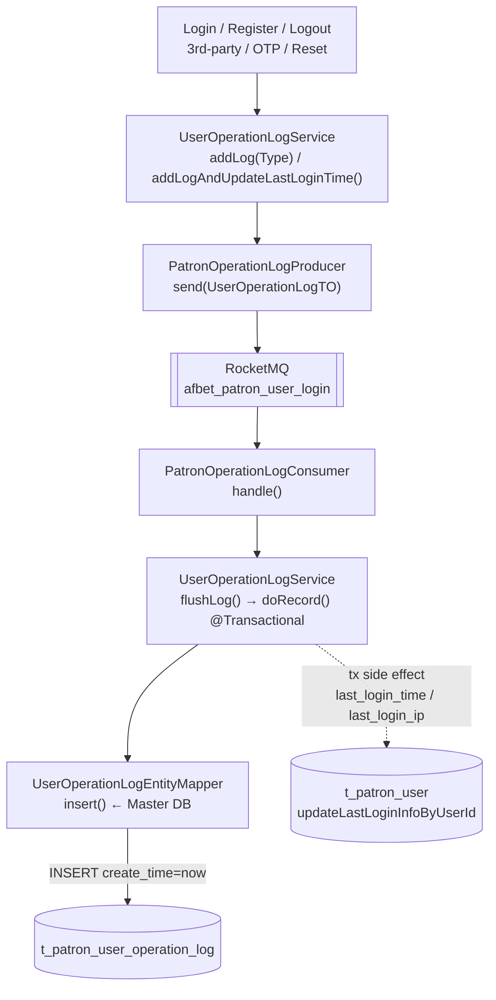

| Step | Component                                       | Purpose                                                                                         | DB columns touched                                                                                                                                |
|------|-------------------------------------------------|-------------------------------------------------------------------------------------------------|---------------------------------------------------------------------------------------------------------------------------------------------------|
| 1    | Various controllers / services                  | login / register / refresh / logout / reset password etc. call `addLog*`                        | —                                                                                                                                                 |
| 2    | `PatronOperationLogProducer`                    | publishes to topic `afbet_patron_user_login`, key=userId (partition ordering)                   | —                                                                                                                                                 |
| 3    | `PatronOperationLogConsumer`                    | consumes the message and calls `UserOperationLogService.flushLog`                               | —                                                                                                                                                 |
| 4    | `UserOperationLogService.flushLog` / `doRecord` | `@Transactional`, updates `t_patron_user.last_login_time/last_login_ip` and inserts the log row | write: `id, user_id, operation_type, ip, operation_channel, phone_model, download_channel(fingerprint), create_time(=now), is_del(=0), device_id` |

Key observation: `create_time` is always "now"; there is no backfill. No `UPDATE` touches an existing row → **write-once holds**.

---

### 📖 Read path A — latest mobile operation snapshot

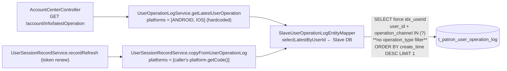

- `GET /account/info/latestOperation` (via `UserOperationLogService.getLatestUserOperation`): hardcodes `platforms = [ANDROID, IOS]`. Returns the latest retained ANDROID/IOS operation row. There is no `operation_type` filter, so this is not a pure "login-only" view.
- `UserSessionRecordService.recordRefresh` (via `copyFromUserOperationLog`): passes `Collections.singletonList(platform.getCode())` — the **caller's actual platform** at token-renew time (e.g., WEB, WAP, ANDROID, IOS). The fallback seeds the session record limited to that single platform; it is **not** restricted to ANDROID/IOS.
- Lookback: latest-only per platform (`ORDER BY create_time DESC LIMIT 1`, force `idx_userid`). Archive-safe for active sessions. Semantics are "latest retained operation on the given platform(s)", not strictly "latest login".

---

### 📖 Read path B — failed-login limiter (30 min window)

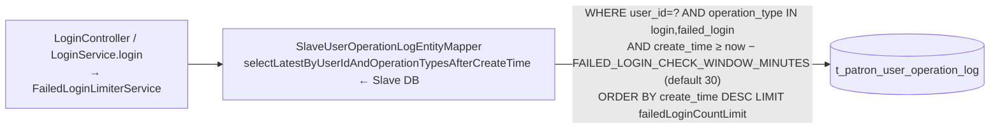

- Lookback: **`create_time ≥ now - 30 min`** (controlled by `FAILED_LOGIN_CHECK_WINDOW_MINUTES`, default 30). 30 min ≪ 179 days → safe.

---

### 📖 Read path C — daily suspicious-device scan

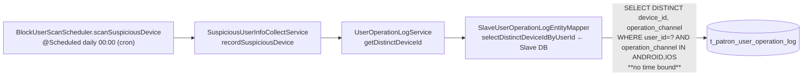

- Paginates through suspicious users → fetches every ANDROID/IOS `device_id` they ever used → inserts into `t_patron_suspicious_device`.
- Lookback: **unbounded**. If a user has not used a given device within 179 days, that device disappears from the distinct set.
- Mitigation: these users are usually flagged recently, so recent rows exist; the edge case is still real in principle.

---

### 📖 Read path D — latest action subset for blacklist / analytics

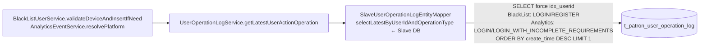

- `BlackListUserService.validateDeviceAndInsertIfNeed` asks for `{LOGIN, REGISTER}`.
- `AnalyticsEventService.resolvePlatform` asks for `{LOGIN, LOGIN_WITH_INCOMPLETE_REQUIREMENTS}`.
- Both are latest-only and usually invoked around active flows, but they are not the same business subset; neither caller includes `BIO_LOGIN`.

---

### 📖 Read path E — `/ms/users/devices` cross-service device lookup

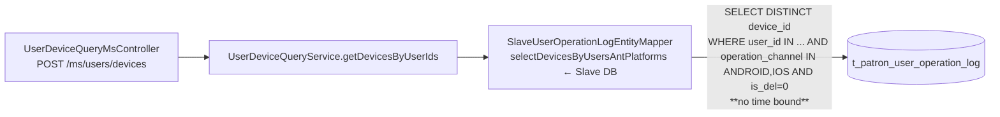

- No in-repo Feign client maps to `POST /ms/users/devices`; `UserDeviceQueryMservice` only covers `GET /ms/user/device` (path F). The downstream caller of this endpoint is **not knowable from inside this repo**.
- Lookback: **unbounded**. If the downstream semantics is "every mobile device the user ever used", devices older than 179 days go missing.

---

### 📖 Read path F — MS latest LOGIN/REGISTER address / device (`/ms/user/device`)

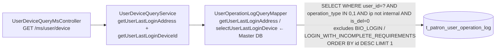

- Both queries filter `operation_type in (0,1)` and `is_del = 0`, so the endpoint is really "latest retained LOGIN/REGISTER info", not "latest auth event of any kind".
- Uses `id DESC` as a proxy for `create_time DESC` (monotonic time-sortable ID).
- Archive impact: if a user only has `BIO_LOGIN` / `LOGIN_WITH_INCOMPLETE_REQUIREMENTS` within retention and the older `0/1` rows have aged out, the endpoint can move from "stale old login/register row" to `NULL` / `RESOURCE_NOT_FOUND`. This is partly a pre-existing query-semantic mismatch, not a pure archive-only problem.

---

### 📖 Read path G — client-info stats `/ms/users/stats`

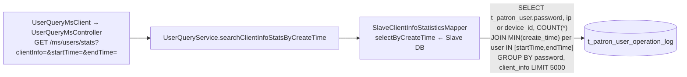

- Admin / marketing supply `startTime/endTime`; each user's earliest row inside the range is used as representative.
- Lookback: bounded by admin input. Compatible with the archive rule iff the admin query window ≤ 179 days.

---

### 📖 Read path H — admin operation-log count (bounded)

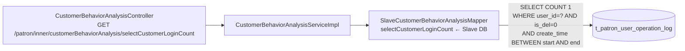

- Counts all non-deleted operation rows in `[start,end]`; there is no `operation_type` filter, so this is not a strict login count.
- Lookback: bounded by admin's `start/end`. Same retention constraint as G.

---

### 📖 Read path I — admin MAX(operation_time) (unbounded)

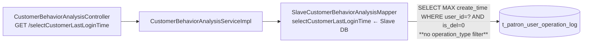

- No time predicate. This returns `MAX(create_time)` across all non-deleted operation rows, not a guaranteed "last successful login". If all rows are older than 179 days and archived, it returns `NULL`.
- Do not blindly fall back to `t_patron_user.last_login_time`: that column is updated by several non-success-login flows as well (for example `REGISTER`, `LOGIN_WITH_INCOMPLETE_REQUIREMENTS`, and phone-password `FAILED_LOGIN` attempts), so it is not a clean replacement for "last successful login".
- Mitigation: either relabel the BO field to "latest retained operation time", or introduce a dedicated successful-login source/query before relying on it for archive-proof semantics.

---

## Column Access Matrix

| Path | Direction | Columns touched                                                                                                             | WHERE columns                                                                                                                     | Lookback / dimension                                                       |
|------|-----------|-----------------------------------------------------------------------------------------------------------------------------|-----------------------------------------------------------------------------------------------------------------------------------|----------------------------------------------------------------------------|
| W    | write     | id, user_id, operation_type, ip, operation_channel, phone_model, download_channel, create_time(=now), is_del(=0), device_id | —                                                                                                                                 | insert, `create_time=now`                                                  |
| A    | read      | id, user_id, operation_type, ip, operation_channel, phone_model, create_time, is_del, device_id                             | user_id, operation_channel (ANDROID/IOS hardcoded for `getLatestUserOperation`; caller's platform for `copyFromUserOperationLog`) | latest platform-specific operation / `create_time` DESC                    |
| B    | read      | same as A                                                                                                                   | user_id, operation_type, create_time                                                                                              | 30 min window / `create_time`                                              |
| C    | read      | device_id, operation_channel                                                                                                | user_id, operation_channel                                                                                                        | unbounded (all-time)                                                       |
| D    | read      | id, user_id, operation_type, ..., device_id                                                                                 | user_id, operation_type                                                                                                           | latest-only / `create_time` DESC (caller-specific `operation_type` subset) |
| E    | read      | device_id (DISTINCT)                                                                                                        | user_id IN, operation_channel, is_del                                                                                             | unbounded                                                                  |
| F    | read      | ip, device_id, operation_channel                                                                                            | user_id, operation_type, ip pattern, is_del                                                                                       | latest-only / `id` DESC, `LOGIN/REGISTER` subset only                      |
| G    | read      | `t_patron_user.password`, ip or device_id, COUNT                                                                            | user_id, create_time ∈ [start,end], ip pattern, device_id not-null                                                                | admin-bounded                                                              |
| H    | read      | COUNT(1)                                                                                                                    | user_id, is_del, create_time ∈ [start,end]                                                                                        | admin-bounded (all operation rows)                                         |
| I    | read      | MAX(create_time)                                                                                                            | user_id, is_del                                                                                                                   | unbounded `MAX` across all operation rows                                  |

## BE Impact Evaluation

### Path-by-path BE impact matrix (179-day rule)

| Path | Lookback / dimension                               | Latest-only?           | Window-bounded?            | Partial loss acceptable? | Table stable? | Verdict / evidence                                                                                                                                                                      |
|------|----------------------------------------------------|------------------------|----------------------------|--------------------------|---------------|-----------------------------------------------------------------------------------------------------------------------------------------------------------------------------------------|
| W    | write                                              | n/a                    | n/a                        | n/a                      | YES           | acceptable — INSERT only, `create_time=now`, never mutates old rows                                                                                                                     |
| A    | latest platform-specific operation / `create_time` | YES                    | —                          | —                        | YES           | **acceptable** — latest-only per platform; `getLatestUserOperation` hardcodes ANDROID/IOS, `copyFromUserOperationLog` uses caller's platform; no `operation_type` filter in either case |
| B    | 30 min                                             | NO                     | YES (30 min ≪ 179 d)       | —                        | YES           | **acceptable** — fixed 30-minute rolling window                                                                                                                                         |
| C    | unbounded                                          | NO                     | NO                         | conditional              | YES           | **conditional** — users flagged recently likely have fresh rows, but devices last used > 179 days ago can still be missed                                                               |
| D    | latest-only                                        | YES                    | —                          | —                        | YES           | **acceptable** — two caller-specific latest-only subsets (`{LOGIN,REGISTER}` and `{LOGIN,LOGIN_WITH_INCOMPLETE_REQUIREMENTS}`); neither includes `BIO_LOGIN`                            |
| E    | unbounded                                          | NO                     | NO                         | unknown                  | YES           | **conditional** — downstream MS consumer unknown; lifetime device coverage would break                                                                                                  |
| F    | latest-only (`id` DESC, `LOGIN/REGISTER` subset)   | YES                    | —                          | conditional              | YES           | **conditional** — latest-only within the `LOGIN/REGISTER` subset, but archive can surface `NULL` if only `BIO_LOGIN` / `LOGIN_WITH_INCOMPLETE_REQUIREMENTS` rows remain in retention    |
| G    | admin-bounded                                      | NO                     | YES if admin range ≤ 179 d | conditional              | YES           | **conditional** — depends on admin's query range; document the retention cap clearly                                                                                                    |
| H    | admin-bounded                                      | NO                     | YES if admin range ≤ 179 d | conditional              | YES           | **conditional** — bounded by admin range, but current SQL counts all operation rows, not only login events                                                                              |
| I    | unbounded `MAX`                                    | YES (latest operation) | NO                         | conditional              | YES           | **conditional** — `MAX(create_time)` over all operation rows; dormant users return `NULL`, and `t_patron_user.last_login_time` is not a drop-in fallback                                |

**Table-level stability check**: ✅ YES — no `UPDATE` path exists, writes never touch old rows, `create_time` is always `now`, and `is_del` is only ever set at INSERT. Old rows are perfectly stable.

### Is there a "better rule"?

| Option                                                      | Pros                                                                                                     | Cons                                                                                                                                                                                                                       | Verdict                                                                                   |
|-------------------------------------------------------------|----------------------------------------------------------------------------------------------------------|----------------------------------------------------------------------------------------------------------------------------------------------------------------------------------------------------------------------------|-------------------------------------------------------------------------------------------|
| **A. Keep 179 days on `create_time`**                       | Matches current storage pattern; index already present; most latest-only / bounded paths remain workable | C/E/I unbounded reads remain, and F/H/I still need semantic clarification                                                                                                                                                  | **Keep**                                                                                  |
| B. Extend to 365 days                                       | Shrinks C/E/I coverage gap                                                                               | ~2× table size; higher I/O and backup cost                                                                                                                                                                                 | Only if business explicitly demands lifetime device / long-gap operation-history coverage |
| C. Shorten to 90 days                                       | Smaller table                                                                                            | Amplifies C/E/I gap; G/H admin ceiling drops to 90 days (90-day reports are common but some teams query 180)                                                                                                               | Not recommended unless storage cost is a driver                                           |
| D. Add `operation_type` filter (keep login/register longer) | Preserves "latest login/register" semantics                                                              | Two-part predicate → two rules or partition; index needs to become `(operation_type, create_time)`; operational complexity + storage cost do not pay off; real miss in C/E is about device list, not operation_type filter | Not recommended                                                                           |
| E. Add `is_del = 0 / 1` to the predicate                    | —                                                                                                        | Code never updates `is_del`, so adding this condition does not change which rows are archived                                                                                                                              | **No effect**, do not add                                                                 |
| F. Archive by "user activity"                               | Most accurate in theory                                                                                  | Cannot be expressed as a plain archive cron rule; would require a separate batch job + state table, out of scope                                                                                                           | Not recommended                                                                           |
| G. Round to 180 days ("full 6 months")                      | Matches common policy wording                                                                            | Technically identical to 179                                                                                                                                                                                               | Acceptable cosmetic change; not required                                                  |

**Optimal verdict: keep `create_time < DATE_SUB(CURDATE(), INTERVAL 179 DAY)`. Round to 180 days only if naming alignment is desired — technically identical. The leverage is not in changing the rule; it is in getting explicit sign-off on C/E, clarifying the login-vs-operation semantics of F/H/I, and avoiding a misleading fallback for path I.**

### BE Recommendation

Confidence:
- BE review-ready for the "keep 179 days" verdict; C/E need product sign-off, and F/H/I need semantic cleanup before the report should be treated as final.

Assumptions:
- Archive dimension = `create_time` (no equivalent column; table only has one timestamp).
- Retention ≥ typical admin lookback range (usually ≤ 90 days).
- The downstream consumer of `/ms/users/devices` does not rely on lifetime device history (pending confirmation).
- `is_del` will continue to be never mutated (currently true in code).

Recommended BE decision:
- Keep the current archive rule on `create_time`.

Condition:
- `create_time < DATE_SUB(CURDATE(), INTERVAL 179 DAY)` — keep as-is; or align to `180 DAY` for "6 months" wording (technically identical).

idx_create_time:
- ✅ already exists

write-once:
- ✅ no `UPDATE` on `t_patron_user_operation_log` (code never updates any column, including `is_del`)

Risk items:
- Path C `selectDistinctDeviceIdByUserId` (suspicious-device scheduler): devices last used > 179 days ago will not appear in the suspicious-device set → confirm with risk / KYC owner; if long-term device coverage is required, fall back to a longer-term event table such as `t_patron_user_device`.
- Path E `/ms/users/devices`: downstream callers unknown in-repo; check with teams consuming this MS endpoint whether lifetime device coverage is required.
- Path F `/ms/user/device`: query only considers `LOGIN/REGISTER`; if BO expects `BIO_LOGIN` or `LOGIN_WITH_INCOMPLETE_REQUIREMENTS` to count as login-like events, archive can turn an old fallback row into `RESOURCE_NOT_FOUND`.
- Path I `selectCustomerLastLoginTime`: dormant users return `NULL`, and the current query is really "latest retained operation time" rather than guaranteed "last successful login". Do not substitute `t_patron_user.last_login_time` blindly.
- Paths G/H: admin query range must be ≤ retention window, otherwise counts undercount; also confirm whether H is intentionally an operation-count view rather than a login-count view.

Action items before closing `SPLT-679`:
- [ ] Get risk / KYC owner sign-off that path C is allowed to miss devices > 179 days old.
- [ ] Enumerate the real callers of `/ms/users/devices` and confirm whether lifetime device coverage is required.
- [ ] Clarify whether `/ms/user/device` should treat `BIO_LOGIN` / `LOGIN_WITH_INCOMPLETE_REQUIREMENTS` as valid login-like events; if yes, widen the query or document the subset explicitly.
- [ ] Decide whether H/I should be relabeled as operation-log views or fixed with an `operation_type` filter.
- [ ] Do **not** add a blind fallback to `t_patron_user.last_login_time`; if BO really needs archive-proof "last successful login", add a dedicated source/query or narrow the writers first.
- [ ] If G/H stay as-is, document that admin query ranges must be ≤ retention days.
- [ ] Decide whether to round the rule from 179 to 180 days for wording alignment (docs only, not a technical change).
- [ ] If the deprecated `findByCreateTime` is truly unused, clean it up in a follow-up PR to reduce future misuse.
