# Archive Analysis Report: `t_patron_user_trusted_device`

**Generated:** 2026-04-23  
**Database:** `afbet_patron` (inferred from the `t_patron_*` namespace — not confirmed from datasource config in this repo)  
**SOP Reference:** https://opennetltd.atlassian.net/wiki/spaces/DBA/pages/4252532749

---

## Assessment Scope

> This report is a code-based assessment of whether `t_patron_user_trusted_device`
> supports a safe archive rule under the current `service-patron`
> implementation.
>
> Conclusion from current code behavior:
> `t_patron_user_trusted_device` should **not** be archived by `create_time`
> under the current implementation. The write path performs an unbounded
> cross-user device ownership check (`device_id` seen under any other
> `user_id`), so archiving old rows would change the answer and could allow a
> device previously associated with another user to be registered again. The
> table is append-only and operationally stable, but archive safety is blocked
> by query semantics, not by row mutability.

---

## Assumptions / Confidence

- Working archive predicate if archive is revisited:
  `create_time < DATE_SUB(CURDATE(), INTERVAL N DAY)`.
- `create_time` is the only time column actually used in reads against this
  table.
- `N` must be at least the runtime-configured
  `trusted.device.config.keepRecordForXDays`; the fallback default in code is
  30 days.
- `TrustedDeviceConfigVo` is present in this repo at
  `service-patron-api/src/main/java/com/xyzbet/afbet/patron/client/vo/TrustedDeviceConfigVo.java`.
  Its `keepRecordForXDays` field is an unconstrained `Integer` with no
  `@Max`/`@Min` annotation, so the valid upper bound is not enforced at code
  level and depends on the runtime config system.
- Slave / master DB routing for the two mappers is assumed from naming
  convention (`SlaveUserTrustedDeviceMapper` → slave,
  `UserTrustedDeviceMapper` → master); the actual datasource routing config
  is not present in this repo. All `<- Slave DB` / `<- Master DB` labels in
  diagrams below reflect this assumption.
- Report label: `preliminary`.

---

## Blocker / Risk Summary

| #  | Risk                                           | Severity   | Detail                                                                                                                                                                                                                                                                                  |
|----|------------------------------------------------|------------|-----------------------------------------------------------------------------------------------------------------------------------------------------------------------------------------------------------------------------------------------------------------------------------------|
| B1 | Unbounded cross-user device ownership precheck | **HIGH**   | `TrustedDeviceService.register()` first runs `countAllByUserIdNotAndDeviceId(userId, deviceId)` with no time predicate. That makes old rows part of current business logic. Archiving old rows would allow false negatives and could re-enable devices previously tied to another user. |
| B2 | Windowed read paths depend on runtime config   | **MEDIUM** | `checkBy()` and part of `register()` use `create_time > now() - interval #{days} day`, where `days` comes from `trusted.device.config.keepRecordForXDays`. The fallback default is 30 days, but the runtime maximum is unknown from inspected code.                                     |
| B3 | No standalone `idx_create_time`                | **LOW**    | The table has `idx_user_id_device_id_create_time_ip`, but `create_time` is the third column. That supports current business reads, not a pure `create_time` range purge. A standalone `idx_create_time` should be added before any archive batch if the blocker is ever resolved.       |

---

## DDL Summary

```sql
CREATE TABLE `t_patron_user_trusted_device`
(
    `id`          bigint unsigned NOT NULL AUTO_INCREMENT COMMENT 'PK',
    `user_id`     varchar(30)     NOT NULL COMMENT 'User Id',
    `device_id`   varchar(40)     NOT NULL COMMENT 'Device Id',
    `ip`          varchar(16)     NOT NULL COMMENT 'IP',
    `platform`    varchar(10)     NOT NULL COMMENT 'Platform',
    `app_version` varchar(10)     NOT NULL COMMENT 'App Version',
    `create_time` datetime        NOT NULL DEFAULT CURRENT_TIMESTAMP COMMENT 'Create Datetime',
    `update_time` datetime        NOT NULL DEFAULT CURRENT_TIMESTAMP COMMENT 'Update Datetime',
    PRIMARY KEY (`id`),
    KEY `idx_user_id_device_id_create_time_ip` (`user_id`, `device_id`, `create_time`, `ip`),
    KEY `idx_device_id_user_id` (`device_id`, `user_id`)
) ENGINE = InnoDB;
```

### Index Readiness for Archive

| Index | Columns | Archive Use | Note |
|-------|---------|-------------|------|
| `PRIMARY` | `id` | Point lookup only | Not useful as the archive dimension |
| `idx_user_id_device_id_create_time_ip` | `user_id, device_id, create_time, ip` | Supports current windowed reads | Useful for current SQL, but not a leading `create_time` purge index |
| `idx_device_id_user_id` | `device_id, user_id` | Supports ownership check | The blocker query depends on this index and on full retained history |

> There is **no standalone `idx_create_time`** in the inspected DDL.

---

## Basic Judgment

- `idx_create_time`: **no**
- Archive candidate column from actual SQL: **`create_time`**
- `write-once`: **yes** - no `UPDATE` or `DELETE` against this table was found
- Direct mapper count: **2** (`SlaveUserTrustedDeviceMapper` for reads,
  `UserTrustedDeviceMapper` for writes; note `UserTrustedDeviceMapper extends
  SlaveUserTrustedDeviceMapper` — slave/master DB routing assumed from naming
  convention, not confirmed from datasource config)
- Total path count **accessing this table**: **11** (5 write, 6 read); 3
  additional public endpoints (`:accumulate`, `:queryConfig`, `:modifyConfig`)
  exist in `TrustedDeviceController` but do not access this table
- Table-level stability: **yes** - rows appear append-only after insert
- Archive verdict: **blocked by unbounded read semantics, not by row mutation**

---

## Overall Dependency Diagram

```mermaid
flowchart TD
    subgraph WRITE["Write Paths"]
        W1["POST /inner/trusted/devices<br>TrustedDeviceController<br>.innerRegisterTrustedDevice"]
        W2["POST /account/info/sportypin/reset/otp/validate<br>WithdrawPINController<br>.validateResetSportyPinOtp<br>(OTP branch)"]
        W3["POST /account/phone/bind/otp/verify/primary-phone<br>AccountPhoneController<br>.verifyPhoneBindingPrimaryPhoneOtp<br>(OTP branch)"]
        W4["POST /account/primary-phone/bind/otp/verify/old<br>PrimaryPhoneController<br>.verifyOldPhoneOtpSession<br>(OTP branch)"]
        W5["POST /phone/reset-password/otp-verification<br>OtpResetPasswordController<br>.verifyResetPasswordOtp<br>(OTP branch)"]
    end

    subgraph READ_R1["Read R1 - GET /trusted/devices"]
        R1["GET /trusted/devices<br>TrustedDeviceController<br>.checkTrustedDevice"]
    end

    subgraph READ_R2["Read R2 - GET /inner/trusted/devices"]
        R2["GET /inner/trusted/devices<br>TrustedDeviceController<br>.innerCheckTrustedDevice"]
    end

    subgraph READ_R3["Read R3 - SportyPIN trusted-device bypass"]
        R3["POST /account/info/sportypin/reset/otp/validate<br>WithdrawPINController<br>.validateResetSportyPinOtp<br>(trusted-device branch)"]
    end

    subgraph READ_R4["Read R4 - Bind primary phone trusted-device bypass"]
        R4["POST /account/phone/bind/otp/verify/primary-phone<br>AccountPhoneController<br>.verifyPhoneBindingPrimaryPhoneOtp<br>(trusted-device branch)"]
    end

    subgraph READ_R5["Read R5 - Change primary phone trusted-device bypass"]
        R5["POST /account/primary-phone/bind/otp/verify/old<br>PrimaryPhoneController<br>.verifyOldPhoneOtpSession<br>(trusted-device branch)"]
    end

    subgraph READ_R6["Read R6 - Reset password trusted-device bypass"]
        R6["POST /phone/reset-password/otp-verification<br>OtpResetPasswordController<br>.verifyResetPasswordOtp<br>(trusted-device branch)"]
    end

    CHECK["TrustedDeviceService<br>.checkBy"]
    REG["TrustedDeviceService<br>.register"]
    WIN["SlaveUserTrustedDeviceMapper<br>.countAllByUserIdAndDeviceId<br>or .countAllByUserIdAndDeviceIdAndIp<br><- Slave DB"]
    OWN["SlaveUserTrustedDeviceMapper<br>.countAllByUserIdNotAndDeviceId<br><- Slave DB"]
    INS["UserTrustedDeviceMapper<br>.insert<br><- Master DB"]
    TABLE[("t_patron_user_trusted_device")]

    W1 --> REG
    W2 --> REG
    W3 --> REG
    W4 --> REG
    W5 --> REG

    R1 --> CHECK
    R2 --> CHECK
    R3 --> CHECK
    R4 --> CHECK
    R5 --> CHECK
    R6 --> CHECK

    CHECK --> WIN
    WIN -- "SELECT COUNT by user_id + device_id<br>+ create_time [+ ip]" --> TABLE

    REG --> OWN
    OWN -- "SELECT COUNT by device_id<br>and user_id != current user" --> TABLE
    REG --> WIN
    REG --> INS
    INS -- "INSERT user_id, device_id, ip,<br>platform, app_version, create_time, update_time" --> TABLE
```

---

## Per-Path Details

### W1 - `POST /inner/trusted/devices`

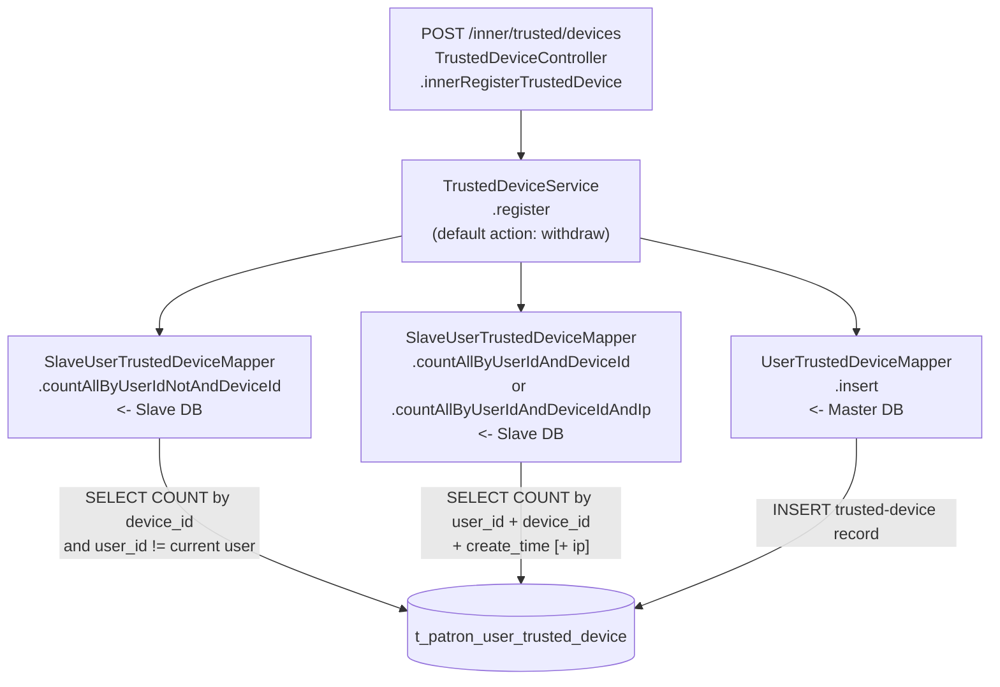

Path summary:
- `TrustedDeviceController.innerRegisterTrustedDevice -> TrustedDeviceService.register -> SlaveUserTrustedDeviceMapper / UserTrustedDeviceMapper`
- SQL: `SELECT COUNT` (unbounded ownership precheck), `SELECT COUNT` (recent-window duplicate precheck), `INSERT`
- Touched columns: `user_id`, `device_id`, `ip`, `platform`, `app_version`, `create_time`, `update_time`
- WHERE columns: ownership precheck uses `device_id` and `user_id != current`; duplicate precheck uses `user_id`, `device_id`, `create_time`, and optionally `ip`
- Lookback / archive dimension: `unbounded + N-day window` / `create_time`
- Purpose: internal trusted-device registration endpoint (callers are in other
  services outside this repo — not verified from inspected code)

### W2 - `POST /account/info/sportypin/reset/otp/validate` (OTP branch)

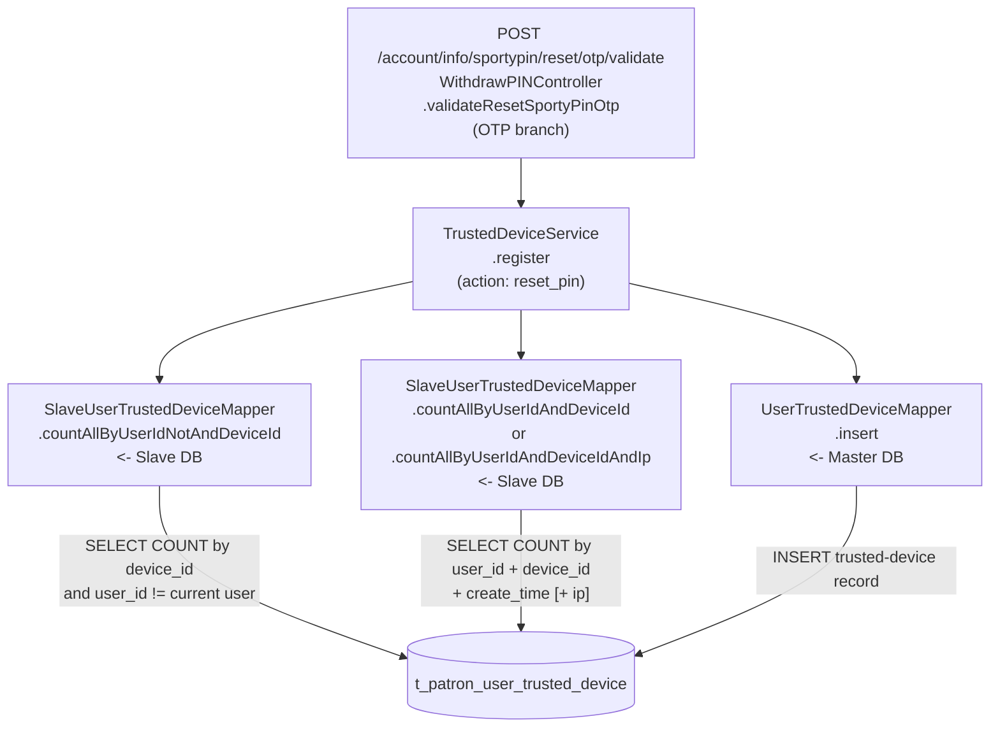

Path summary:
- `WithdrawPINController.validateResetSportyPinOtp -> TrustedDeviceService.register`
- SQL shape is identical to W1; only the business action differs
- Touched columns: `user_id`, `device_id`, `ip`, `platform`, `app_version`, `create_time`, `update_time`
- Lookback / archive dimension: `unbounded + N-day window` / `create_time`
- Purpose: remember the device after successful SportyPIN reset OTP verification

### W3 - `POST /account/phone/bind/otp/verify/primary-phone` (OTP branch)

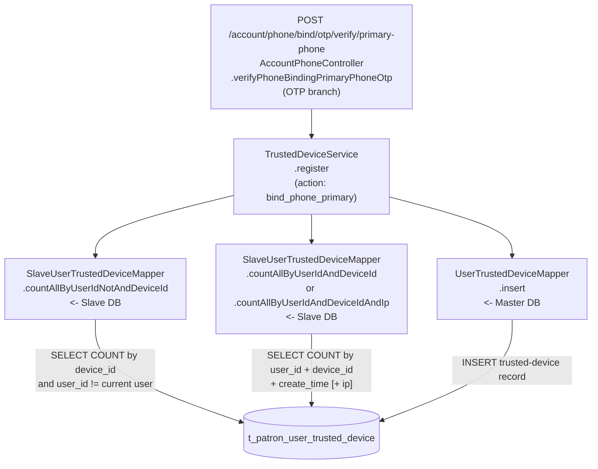

Path summary:
- `AccountPhoneController.verifyPhoneBindingPrimaryPhoneOtp -> TrustedDeviceService.register`
- SQL shape is identical to W1; only the business action differs
- Touched columns: `user_id`, `device_id`, `ip`, `platform`, `app_version`, `create_time`, `update_time`
- Lookback / archive dimension: `unbounded + N-day window` / `create_time`
- Purpose: remember the device after successful primary-phone binding OTP verification

### W4 - `POST /account/primary-phone/bind/otp/verify/old` (OTP branch)

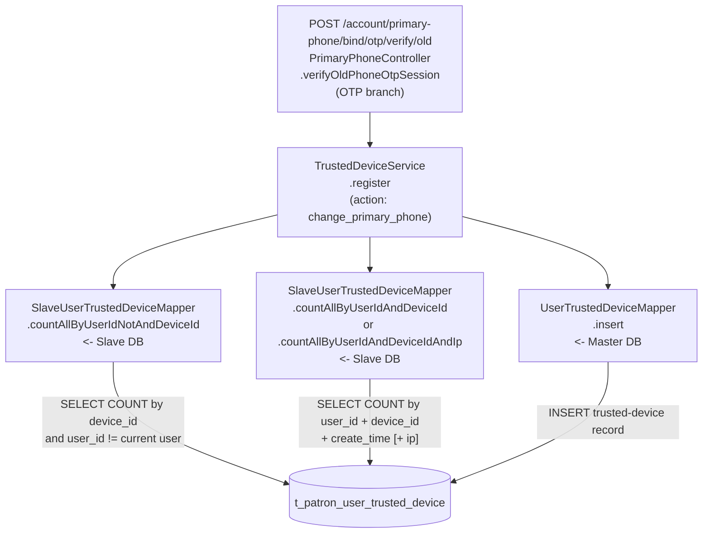

Path summary:
- `PrimaryPhoneController.verifyOldPhoneOtpSession -> TrustedDeviceService.register`
- SQL shape is identical to W1; only the business action differs
- Touched columns: `user_id`, `device_id`, `ip`, `platform`, `app_version`, `create_time`, `update_time`
- Lookback / archive dimension: `unbounded + N-day window` / `create_time`
- Purpose: remember the device after successful old-phone OTP verification in the primary-phone change flow

### W5 - `POST /phone/reset-password/otp-verification` (OTP branch)

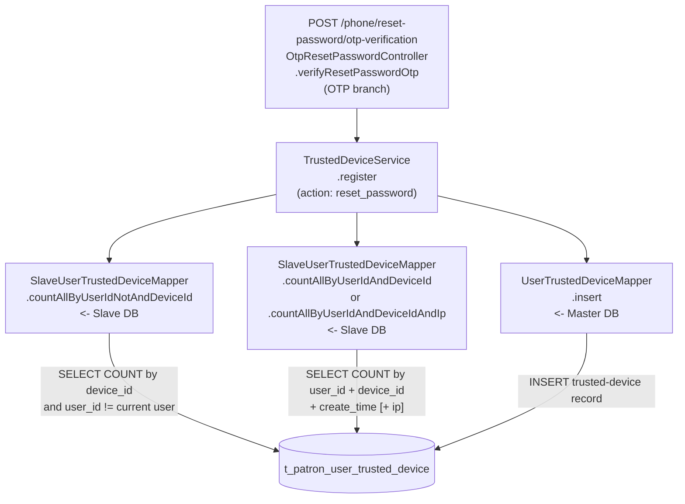

Path summary:
- `OtpResetPasswordController.verifyResetPasswordOtp -> TrustedDeviceService.register`
- SQL shape is identical to W1; only the business action differs
- Touched columns: `user_id`, `device_id`, `ip`, `platform`, `app_version`, `create_time`, `update_time`
- Lookback / archive dimension: `unbounded + N-day window` / `create_time`
- Purpose: remember the device after successful password reset OTP verification

### R1 - `GET /trusted/devices`

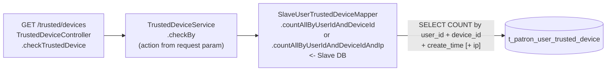

Path summary:
- `TrustedDeviceController.checkTrustedDevice -> TrustedDeviceService.checkBy -> SlaveUserTrustedDeviceMapper`
- SQL: `SELECT COUNT`
- Touched columns: `user_id`, `device_id`, `ip`, `create_time`
- WHERE columns: `user_id`, `device_id`, `create_time`, and optionally `ip`
- Lookback / archive dimension: `N-day window` / `create_time`
- Purpose: public API to decide whether a device can skip OTP under the configured trusted-device policy

### R2 - `GET /inner/trusted/devices`

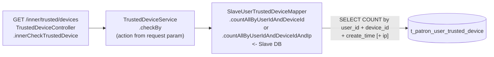

Path summary:
- `TrustedDeviceController.innerCheckTrustedDevice -> TrustedDeviceService.checkBy -> SlaveUserTrustedDeviceMapper`
- SQL: `SELECT COUNT`
- Touched columns: `user_id`, `device_id`, `ip`, `create_time`
- WHERE columns: `user_id`, `device_id`, `create_time`, and optionally `ip`
- Lookback / archive dimension: `N-day window` / `create_time`
- Purpose: internal API variant of the same trusted-device eligibility check

### R3 - `POST /account/info/sportypin/reset/otp/validate` (trusted-device branch)

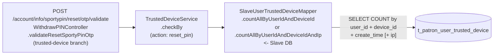

Path summary:
- `WithdrawPINController.validateResetSportyPinOtp -> TrustedDeviceService.checkBy`
- SQL shape is identical to R1; only the business action differs
- Touched columns: `user_id`, `device_id`, `ip`, `create_time`
- Lookback / archive dimension: `N-day window` / `create_time`
- Purpose: bypass SportyPIN reset OTP when the same device is trusted within the configured window

### R4 - `POST /account/phone/bind/otp/verify/primary-phone` (trusted-device branch)

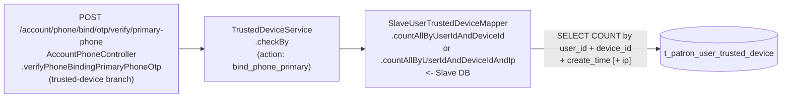

Path summary:
- `AccountPhoneController.verifyPhoneBindingPrimaryPhoneOtp -> TrustedDeviceService.checkBy`
- SQL shape is identical to R1; only the business action differs
- Touched columns: `user_id`, `device_id`, `ip`, `create_time`
- Lookback / archive dimension: `N-day window` / `create_time`
- Purpose: bypass primary-phone binding OTP when the same device is trusted within the configured window

### R5 - `POST /account/primary-phone/bind/otp/verify/old` (trusted-device branch)

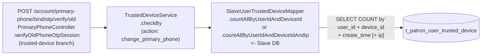

Path summary:
- `PrimaryPhoneController.verifyOldPhoneOtpSession -> TrustedDeviceService.checkBy`
- SQL shape is identical to R1; only the business action differs
- Touched columns: `user_id`, `device_id`, `ip`, `create_time`
- Lookback / archive dimension: `N-day window` / `create_time`
- Purpose: bypass old-phone OTP during primary-phone change when the same device is trusted within the configured window

### R6 - `POST /phone/reset-password/otp-verification` (trusted-device branch)

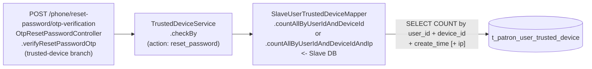

Path summary:
- `OtpResetPasswordController.verifyResetPasswordOtp -> TrustedDeviceService.checkBy`
- SQL shape is identical to R1; only the business action differs
- Touched columns: `user_id`, `device_id`, `ip`, `create_time`
- Lookback / archive dimension: `N-day window` / `create_time`
- Purpose: bypass reset-password OTP when the same device is trusted within the configured window

---

## Field Access Matrix

| Path(s) | Direction | Touched Columns                                                                       | WHERE Columns                                                                                                                   | Lookback / Dimension                       |
|---------|-----------|---------------------------------------------------------------------------------------|---------------------------------------------------------------------------------------------------------------------------------|--------------------------------------------|
| W1-W5   | write     | `user_id`, `device_id`, `ip`, `platform`, `app_version`, `create_time`, `update_time` | ownership precheck: `device_id`, `user_id != current`; duplicate precheck: `user_id`, `device_id`, `create_time`, optional `ip` | `unbounded + N-day window` / `create_time` |
| R1-R6   | read      | `user_id`, `device_id`, `ip`, `create_time`                                           | `user_id`, `device_id`, `create_time`, optional `ip`                                                                            | `N-day window` / `create_time`             |

---

## Archive Rule Evaluation

### Q1 to Q4 Decision Matrix

| Path  | Lookback / Dimension                                                                                 | Q1 | Q2  | Q3  | Q4 (table) | Verdict / Evidence                                                                                                                                                               |
|-------|------------------------------------------------------------------------------------------------------|----|-----|-----|------------|----------------------------------------------------------------------------------------------------------------------------------------------------------------------------------|
| R1-R6 | `N-day window` on `create_time`, optional exact `ip` match                                           | NO | YES | N/A | YES        | `acceptable` only if archive retention is greater than or equal to the effective `keepRecordForXDays`. These paths already ignore rows outside the configured window.            |
| W1-W5 | Unbounded cross-user `device_id` ownership check plus `N-day` duplicate suppression on `create_time` | NO | NO  | NO  | YES        | `blocker`. `countAllByUserIdNotAndDeviceId` has no time bound and is used to block registration when a device belongs to another user. Archiving old rows changes that decision. |

### Q4 Table-Level Stability

- `YES`
- Evidence: no `UPDATE` or `DELETE` against `t_patron_user_trusted_device` was
  found in inspected Java mappers or callers
- Implication: rows look mature enough for archive from a mutability
  perspective, but archive is still blocked because old rows remain part of
  current read logic

---

## Final Recommendation

Confidence:
- `preliminary`

Assumptions:
- `create_time` is the archive candidate dimension because all time-bounded reads use it.
- `N` must be greater than or equal to the effective `keepRecordForXDays`; the fallback default is 30 days, but the runtime maximum is unknown from inspected code.

Archive Rule:
- [ ] Recommended now
- [x] Not recommended under current code

Condition:
- Do **not** submit a `create_time` archive rule for
  `t_patron_user_trusted_device` until the cross-user device ownership rule is
  redesigned or moved elsewhere.

`idx_create_time`:
- `No standalone idx_create_time. Add one before any range-delete review if archive is revisited.`

Write-once:
- `Yes. No UPDATE or DELETE against this table was found in the inspected repo.`

Risks:
- `W1-W5`: `register()` depends on full-history device ownership. Archiving old rows would allow false negatives in `countAllByUserIdNotAndDeviceId`.
- `R1-R6`: windowed reads are safe only when archive retention is greater than or equal to the real configured trusted-device window.

Action items before DBA review:
- [ ] Decide whether "a device seen under another user stays blocked forever" is still a required business / risk rule.
- [ ] If yes, keep this table unarchived, or move permanent device ownership to a separate non-archived table keyed by `device_id`.
- [ ] If no, redesign `countAllByUserIdNotAndDeviceId` to a bounded or state-based rule, then re-run archive review.
- [ ] Confirm the allowed range or cap for `keepRecordForXDays` in the real config contract.
- [ ] Add a standalone `idx_create_time` before any archive job or range purge.

---

## Evidence References

- DDL:
  `service-patron/src/test/resources/db/migration/V78__2025-03-10-17-47_created_tables_for_local_my_batis_test.sql:89-102`
- Slave mapper SQL:
  `service-patron/src/main/accountcore/com/xyzbet/afbet/patron/dal/db/slave/dao/SlaveUserTrustedDeviceMapper.java:9-46`
- Master mapper SQL:
  `service-patron/src/main/accountcore/com/xyzbet/afbet/patron/dal/db/dao/UserTrustedDeviceMapper.java:10-14`
- Service logic:
  `service-patron/src/main/java/com/xyzbet/afbet/patron/biz/TrustedDeviceService.java:42-145`
- Public / internal trusted-device API:
  `service-patron/src/main/java/com/xyzbet/afbet/patron/controller/patron/TrustedDeviceController.java:40-128`
- Config VO:
  `service-patron-api/src/main/java/com/xyzbet/afbet/patron/client/vo/TrustedDeviceConfigVo.java`
- SportyPIN flow:
  `service-patron/src/main/java/com/xyzbet/afbet/patron/controller/patron/WithdrawPINController.java:306-361`
- Bind primary phone flow:
  `service-patron/src/main/java/com/xyzbet/afbet/patron/controller/patron/user/phone/AccountPhoneController.java:112-179`
- Change primary phone flow:
  `service-patron/src/main/java/com/xyzbet/afbet/patron/controller/patron/user/phone/PrimaryPhoneController.java:134-205`
- Reset password flow:
  `service-patron/src/main/java/com/xyzbet/afbet/patron/controller/patron/user/password/phone/OtpResetPasswordController.java:104-161`
