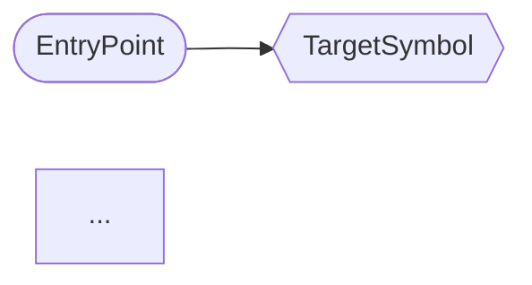
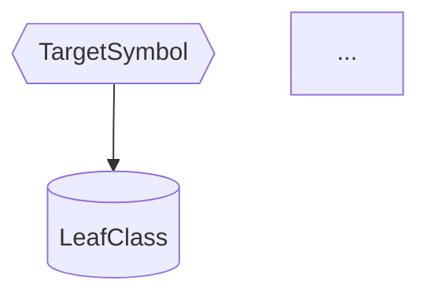

# Report Template

Do **not** wrap the entire report in a fenced `markdown` block.
Use `flowchart` only for Mermaid. Do **not** emit `sequenceDiagram`.

---

# Call Chain Trace: `<TARGET_SYMBOL>`

## Session Info

- Target: `<symbol>`
- Scope: `<directory or file pattern>`
- Direction: `<callers | callees | both>`
- Date: `<YYYY-MM-DD>`
- Confidence: `<preliminary | confirmed>`

## Summary

- Direct references found: `<N files>`
- Total call paths traced: `<N>`
- Async paths: `<N>`
- Conditional paths: `<N>`
- Confidence distribution: `high N | medium N | low N`
- Harness gaps resolved: `<N / N>`

## Harness Validation

```
Paths verified:   N / N
  high:     N
  medium:   N
  low:      N

Gaps found:       N
  resolved: N
  unresolved: N — <list>

Anomalies:        N — <list>
```

## Overview Diagram

<!-- max 2–3 levels deep, ≤15 nodes. Split into Part 1 / Part 2 if larger. -->



## Caller Paths

<!-- Repeat this block for each caller path -->

### Path A — <path_name>


| Step | Component        | Action                  | Notes                  |
|------|-----------------|-------------------------|------------------------|
| 1    | `EntryClass`    | initiates call          | e.g. HTTP POST /path   |
| 2    | `ServiceClass`  | delegates               | conditional: <hint>    |
| ...  | `TargetClass`   | **← target reached**    | file:line              |

Path summary:
- Chain: `Entry.method() → ... → Target.method()`
- Call type: `<sync | async | ...>`
- Conditional: `<yes — condition | no>`
- Side effects: `<list or none>`
- Error propagation: `<exception-propagated | silent | ...>`
- Business purpose: `<one sentence>`
- Confidence: `<high | medium | low>`

---

## Callee Paths

<!-- If direction=callees or both — repeat this block for each callee path -->

### Path Z — <path_name>



| Step | Component     | Action         | Notes     |
|------|--------------|----------------|-----------|
| 1    | `TargetClass` | calls         |           |
| ...  | `LeafClass`   | **← terminal** | file:line |

---

## Call Chain Matrix

| Path | Direction | Entry Point     | Layers            | Async | Conditional | Confidence |
|------|-----------|-----------------|-------------------|-------|-------------|------------|
| A    | callers   | `Entry.method()`| api→service→repo  | no    | no          | high       |
| B    | callers   | `Scheduler.run()` | scheduler→service | yes   | yes         | medium     |

---

## Debugging Recommendations

Based on the traced call chains:

### High-Risk Paths for This Bug

- **Path X** — `<why this path is relevant to the debug goal>`
  - Conditional on: `<condition>`
  - Side effects: `<what else changes>`
  - Suggested breakpoint: `<file:line>`

### Gaps or Unknowns

- `<gap description>` — could not confirm because `<reason>`

### Next Steps

- `[ ] <concrete debugging action>`
- `[ ] <follow-up trace if needed>`

---

## Mermaid Cheatsheet

| Element               | Format                              |
|-----------------------|-------------------------------------|
| Entry point           | `ENTRY([Label])`                    |
| Target symbol         | `TARGET{{"Label"}}`                 |
| Leaf / terminal       | `LEAF[("Label")]`                   |
| Async boundary        | `ASYNC[["AsyncBoundary<br>type"]]`  |
| Normal edge           | `-->`                               |
| Conditional edge      | `-- [condition] -->`                |
| Dashed side-effect    | `-.-> RESOURCE`                     |
| Line break in label   | `<br>` only (never `\n`)            |
| Direction (callers)   | `flowchart LR`                      |
| Direction (callees)   | `flowchart TD`                      |
| Forbidden             | `sequenceDiagram`                   |
| Max nodes per chart   | 15 (split into Part 1 / Part 2 if over) |
| Max lines per label   | 4                                   |